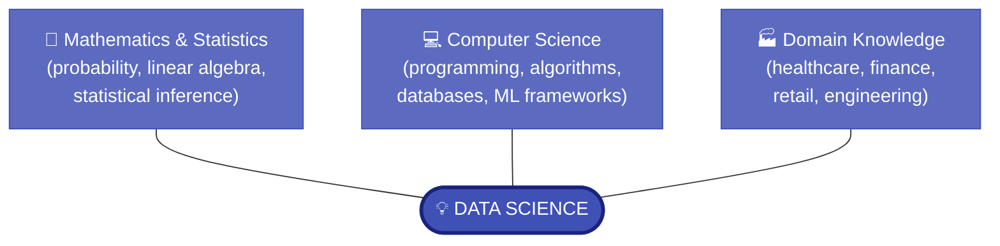
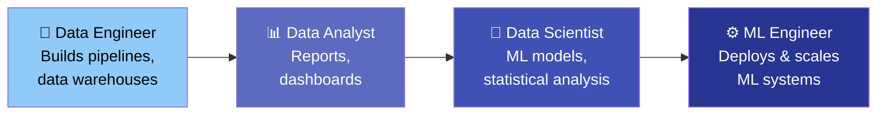

# 1.1 Definition and Scope of Data Science

---

## Theory

### What is Data Science?

!!! note "Definition"
    **Data Science** is an interdisciplinary field that combines **mathematics and statistics**, **computer science and programming**, and **domain-specific knowledge** to extract meaningful insights, patterns, and knowledge from structured and unstructured data.

The term "Data Science" was coined by **Peter Naur** in 1960 and popularised by **DJ Patil** and **Jeff Hammerbacher** around 2008, when they were working at LinkedIn and Facebook respectively.

---

### The Three Pillars of Data Science



Each pillar alone is insufficient:
- Statistics alone → academic papers, not products
- Programming alone → software without insight
- Domain knowledge alone → intuition without rigour

---

### Scope of Data Science

The scope of Data Science covers the entire pipeline from raw data to deployed insights:

| Scope Area | Description |
|-----------|-------------|
| **Data Collection** | Gathering data from sensors, databases, APIs, web scraping |
| **Data Cleaning** | Handling missing values, duplicates, noise |
| **Exploratory Analysis** | Understanding distributions, correlations, patterns |
| **Statistical Inference** | Hypothesis testing, confidence intervals |
| **Machine Learning** | Building predictive and classification models |
| **Deep Learning** | Neural networks for image, text, speech |
| **Data Visualization** | Communicating findings through charts and dashboards |
| **Model Deployment** | Integrating models into applications and APIs |
| **Ethics & Privacy** | Ensuring fairness, transparency, and data protection |

---

### Related Fields and How They Differ

| Field | Relationship to Data Science |
|-------|------------------------------|
| **Statistics** | The mathematical foundation of Data Science |
| **Machine Learning** | A subset — algorithmic learning from data |
| **Artificial Intelligence** | The broader goal; ML is a method to achieve AI |
| **Data Engineering** | Builds the infrastructure for data pipelines |
| **Business Intelligence** | Focuses on descriptive analytics and reporting |
| **Data Analytics** | Subset focused on analysis and interpretation |

---

### Roles in a Data Science Team



---

### Python — Demonstrating the Data Science Ecosystem

```python linenums="1" title="ds_ecosystem.py"
# Program : Data Science Ecosystem Overview
# Topic   : 1.1 Definition and Scope
# Author  : BT255CO Lecture Notes

import sys

# Key Python libraries used in Data Science
libraries = {
    "numpy":        "Numerical computing — arrays, matrices, math",
    "pandas":       "Data manipulation — DataFrames, Series",
    "matplotlib":   "Static plotting — line, bar, scatter, histogram",
    "seaborn":      "Statistical visualization — heatmaps, box plots",
    "scikit-learn": "Machine Learning — classification, regression, clustering",
    "scipy":        "Scientific computing — statistics, optimization",
    "tensorflow":   "Deep Learning — neural networks",
    "plotly":       "Interactive visualizations",
}

print("=" * 60)
print("   BT255CO — Introduction to Data Science")
print(f"   Python {sys.version.split()[0]}")
print("=" * 60)
print("\nCore Libraries in the Data Science Ecosystem:")
print("-" * 60)

for lib, description in libraries.items():
    print(f"  📦 {lib:<18} — {description}")

print("\nData Science covers:")
scope = [
    "Data Collection & Storage",
    "Data Cleaning & Preprocessing",
    "Exploratory Data Analysis (EDA)",
    "Statistical Inference",
    "Machine Learning & AI",
    "Data Visualization",
    "Model Deployment",
    "Ethics & Privacy",
]
for i, item in enumerate(scope, 1):
    print(f"  {i}. {item}")

print("=" * 60)
```

**Output:**
```
============================================================
   BT255CO — Introduction to Data Science
   Python 3.11.0
============================================================

Core Libraries in the Data Science Ecosystem:
------------------------------------------------------------
  📦 numpy              — Numerical computing — arrays, matrices, math
  📦 pandas             — Data manipulation — DataFrames, Series
  📦 matplotlib         — Static plotting — line, bar, scatter, histogram
  📦 seaborn            — Statistical visualization — heatmaps, box plots
  📦 scikit-learn       — Machine Learning — classification, regression, clustering
  📦 scipy              — Scientific computing — statistics, optimization
  📦 tensorflow         — Deep Learning — neural networks
  📦 plotly             — Interactive visualizations

Data Science covers:
  1. Data Collection & Storage
  2. Data Cleaning & Preprocessing
  3. Exploratory Data Analysis (EDA)
  4. Statistical Inference
  5. Machine Learning & AI
  6. Data Visualization
  7. Model Deployment
  8. Ethics & Privacy
============================================================
```

**Line-by-Line Explanation:**

| Line(s) | Code | Explanation |
|---------|------|-------------|
| 7 | `import sys` | Imports the `sys` module to get the Python runtime version |
| 9–17 | `libraries = {...}` | Dictionary mapping library names to descriptions |
| 19–22 | `print(...)` | Prints a formatted header banner |
| 25 | `for lib, description in libraries.items():` | Iterates over each library name and its description |
| 29–38 | `scope = [...]` | A list of Data Science scope areas |
| 39–40 | `for i, item in enumerate(scope, 1):` | `enumerate` adds a counter starting from 1 |

---

## Summary

!!! success "Key Takeaways"
    - Data Science = **Statistics + Computer Science + Domain Knowledge**
    - It covers the **full pipeline** from raw data to deployed insights
    - Key roles: Data Engineer, Data Analyst, Data Scientist, ML Engineer
    - Data Science is **broader than ML and AI** — it includes the entire workflow
    - Python is the **primary language** used in Data Science

---

## Review Questions

1. Define Data Science in your own words. What makes it "interdisciplinary"?
2. What are the three pillars of the Data Science Venn Diagram? What happens if one pillar is missing?
3. How does Data Science differ from traditional Business Intelligence?
4. What is the difference between a Data Analyst and a Data Scientist?
5. List five Python libraries used in Data Science and state the purpose of each.

---

*Next:* [1.2 Applications of Data Science →](1_2.md)
