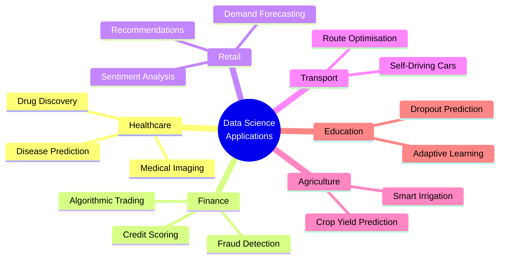

# 1.2 Applications of Data Science

---

## Theory

Data Science has transformed every major industry. Below are the most significant application domains with concrete examples.

---

### Applications Across Industries

=== "Healthcare"
    | Application | Description |
    |-------------|-------------|
    | Disease Prediction | ML models predict diabetes, cancer risk from patient records |
    | Medical Imaging | CNN models detect tumors in X-rays and MRI scans |
    | Drug Discovery | Data mining accelerates identification of drug candidates |
    | Epidemic Forecasting | Time-series models predict disease spread (e.g., COVID-19) |
    | Personalised Medicine | Genomic data tailors treatment plans to individuals |

=== "Finance & Banking"
    | Application | Description |
    |-------------|-------------|
    | Fraud Detection | Anomaly detection flags suspicious credit card transactions |
    | Credit Scoring | ML predicts loan default probability |
    | Algorithmic Trading | Models execute stock trades in milliseconds |
    | Risk Management | Monte Carlo simulations model portfolio risk |
    | Customer Churn | Predict which customers will close accounts |

=== "Retail & E-Commerce"
    | Application | Description |
    |-------------|-------------|
    | Recommendation Systems | Amazon/Netflix suggest products based on past behaviour |
    | Demand Forecasting | Predict inventory requirements by season |
    | Dynamic Pricing | Uber surge pricing based on real-time supply/demand |
    | Sentiment Analysis | NLP analyses customer reviews |
    | Market Basket Analysis | Find products frequently bought together |

=== "Transport"
    | Application | Description |
    |-------------|-------------|
    | Self-Driving Cars | Computer vision + sensor fusion (Tesla, Waymo) |
    | Route Optimisation | Google Maps uses real-time traffic data |
    | Predictive Maintenance | Airlines predict engine failure before it occurs |
    | Ride Sharing | Uber/Ola match drivers with passengers optimally |

=== "Agriculture"
    | Application | Description |
    |-------------|-------------|
    | Crop Yield Prediction | Satellite + weather data predicts harvest quality |
    | Soil Analysis | Sensors detect nutrient deficiencies |
    | Pest Detection | Drone images identify pest infestation early |
    | Smart Irrigation | IoT sensors optimise water usage |

=== "Education"
    | Application | Description |
    |-------------|-------------|
    | Adaptive Learning | Systems adjust difficulty based on student performance |
    | Dropout Prediction | Identify at-risk students early |
    | Plagiarism Detection | NLP compares text similarity |
    | Automated Grading | ML grades short answers and essays |

---

### Data Science Application Map



---

### Python Program — Industry Application Classifier

```python linenums="1" title="ds_applications.py"
# Program : Data Science Applications by Industry
# Topic   : 1.2 Applications of Data Science
# Author  : BT255CO Lecture Notes

applications = {
    "Healthcare": [
        "Disease prediction using ML",
        "Medical image analysis (X-rays, MRI)",
        "Drug discovery and genomics",
        "Epidemic forecasting",
    ],
    "Finance": [
        "Credit card fraud detection",
        "Stock market prediction",
        "Loan default risk scoring",
        "Algorithmic trading",
    ],
    "Retail": [
        "Product recommendation engines",
        "Customer churn prediction",
        "Demand and inventory forecasting",
        "Sentiment analysis of reviews",
    ],
    "Transport": [
        "Autonomous vehicles",
        "Real-time route optimisation",
        "Predictive maintenance of engines",
    ],
    "Agriculture": [
        "Crop yield prediction",
        "Satellite-based soil analysis",
        "Smart irrigation systems",
    ],
}

print("=" * 55)
print("   DATA SCIENCE — APPLICATIONS BY INDUSTRY")
print("=" * 55)

total = 0
for industry, apps in applications.items():
    print(f"\n🏭 {industry}:")
    for app in apps:
        print(f"   ✔ {app}")
    total += len(apps)

print(f"\n{'─' * 55}")
print(f"Total applications listed: {total} across {len(applications)} industries")
print("=" * 55)
```

**Output:**
```
=======================================================
   DATA SCIENCE — APPLICATIONS BY INDUSTRY
=======================================================

🏭 Healthcare:
   ✔ Disease prediction using ML
   ✔ Medical image analysis (X-rays, MRI)
   ✔ Drug discovery and genomics
   ✔ Epidemic forecasting

🏭 Finance:
   ✔ Credit card fraud detection
   ✔ Stock market prediction
   ✔ Loan default risk scoring
   ✔ Algorithmic trading

🏭 Retail:
   ✔ Product recommendation engines
   ✔ Customer churn prediction
   ✔ Demand and inventory forecasting
   ✔ Sentiment analysis of reviews

🏭 Transport:
   ✔ Autonomous vehicles
   ✔ Real-time route optimisation
   ✔ Predictive maintenance of engines

🏭 Agriculture:
   ✔ Crop yield prediction
   ✔ Satellite-based soil analysis
   ✔ Smart irrigation systems

───────────────────────────────────────────────────────
Total applications listed: 18 across 5 industries
=======================================================
```

**Line-by-Line Explanation:**

| Line(s) | Code | Explanation |
|---------|------|-------------|
| 5–34 | `applications = {...}` | Nested dictionary: outer keys are industries, values are lists of applications |
| 37–39 | `print(...)` | Prints a decorative header |
| 41 | `total = 0` | Counter variable initialised to zero |
| 42 | `for industry, apps in applications.items():` | Unpacks each key-value pair from the dictionary |
| 43–45 | `for app in apps:` | Inner loop iterates through the list of applications for each industry |
| 46 | `total += len(apps)` | Adds the number of applications for the current industry to the running total |
| 48 | `len(applications)` | Returns the number of keys (industries) in the dictionary |

---

## Summary

!!! success "Key Takeaways"
    - Data Science is applied across **all major industries**: healthcare, finance, retail, transport, agriculture, and education
    - The most prominent applications include **recommendation systems**, **fraud detection**, **disease prediction**, and **autonomous vehicles**
    - Almost every digital product you use daily (Amazon, Netflix, Google Maps, Uber) is powered by Data Science

---

## Review Questions

1. Name three applications of Data Science in healthcare with brief explanations.
2. How does Amazon's recommendation system use Data Science? Explain the underlying concept.
3. What is "predictive maintenance"? In which industry is it most critical?
4. How is sentiment analysis used in retail? Give an example.
5. List two ways Data Science is used in agriculture.

---

*Previous:* [← 1.1 Definition and Scope](1_1.md) &nbsp;|&nbsp; *Next:* [1.3 Limitations of Data Science →](1_3.md)
