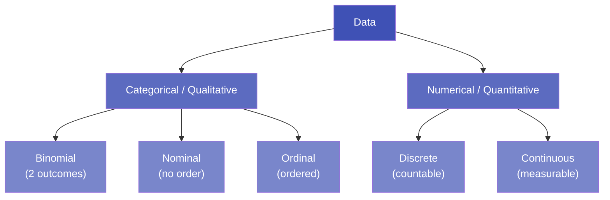

# 1.4 Types of Data

---

## Theory

Understanding data types is the foundation of data analysis. Choosing the wrong statistical method for a data type produces meaningless results.

---

### Classification Overview



---

### 1. Categorical (Qualitative) Data

Categorical data represents **groups or labels**. It cannot be meaningfully added or averaged.

#### a) Binomial Data

!!! note "Definition"
    **Binomial data** (also called **Dichotomous data**) has **exactly two possible outcomes**.

| Characteristic | Details |
|---------------|---------|
| Number of categories | Exactly 2 |
| Examples | Pass/Fail, Yes/No, True/False, Spam/Not-Spam, Alive/Dead |
| Statistical test | Chi-squared test, Logistic Regression |
| Python encoding | `0` and `1` (binary) |

```python
# Binomial data examples
exam_results = ["Pass", "Fail", "Pass", "Pass", "Fail"]  # binary outcome
email_labels = [1, 0, 1, 0, 0]  # 1=Spam, 0=Not Spam
```

---

#### b) Nominal Data (Unordered Categorical)

!!! note "Definition"
    **Nominal data** consists of categories that have **no natural order or ranking**.

| Characteristic | Details |
|---------------|---------|
| Order | None — categories are just names |
| Examples | Blood type (A, B, O, AB), Gender (M/F/Other), City, Country |
| Encoding | One-Hot Encoding |
| Invalid operation | You cannot say A > B or compute mean of blood types |

```python
cities = ["Delhi", "Mumbai", "Chennai", "Kolkata"]
# There is NO ranking between these cities — all are equally valid labels
```

---

#### c) Ordinal Data

!!! note "Definition"
    **Ordinal data** consists of categories that have a **natural order or ranking**, but the **difference between categories is not uniform or meaningful**.

| Characteristic | Details |
|---------------|---------|
| Order | Yes — categories have a clear sequence |
| Uniform intervals | No — "Poor → Good" may not equal "Good → Excellent" |
| Examples | Education level (School < UG < PG < PhD), Rating (1★–5★), Satisfaction (Low/Medium/High) |
| Encoding | Label Encoding (0, 1, 2, 3...) or Ordinal Encoding |

```python
import pandas as pd

ratings = ["Poor", "Good", "Excellent", "Good", "Poor"]
order   = ["Poor", "Good", "Excellent"]

# Create ordered categorical
cat = pd.Categorical(ratings, categories=order, ordered=True)
print(cat.min())      # Poor
print(cat.max())      # Excellent
print(cat > "Good")   # [False, False, True, False, False]
```

---

### 2. Numerical (Quantitative) Data

Numerical data represents **measurable quantities** and supports arithmetic operations.

#### a) Discrete Data

- Values are **countable** whole numbers
- There are **gaps** between possible values
- Examples: Number of students (30, 45), Goals scored (0, 1, 2…), Number of errors

#### b) Continuous Data

- Values can take **any value** within a range, including decimals
- Examples: Temperature (36.6°C), Weight (68.4 kg), Time (1.337 seconds)

---

### Comparison Table

| Type | Order | Intervals | Arithmetic | Example |
|------|-------|-----------|------------|---------|
| **Binomial** | — | — | No | Pass/Fail |
| **Nominal** | No | No | No | Blood type |
| **Ordinal** | Yes | Not uniform | Partial | Rating 1–5 |
| **Discrete** | Yes | Uniform | Yes | Student count |
| **Continuous** | Yes | Uniform | Yes | Height in cm |

---

### Python Program — Identifying and Working with Data Types

```python linenums="1" title="data_types.py"
# Program : Types of Data in Python
# Topic   : 1.4 Types of Data
# Author  : BT255CO Lecture Notes

import pandas as pd
import numpy as np

# -----------------------------------------------------------
# Create a student dataset with all types of data
# -----------------------------------------------------------
data = {
    # Binomial — exactly 2 outcomes
    "passed":       [True, False, True, True, False, True],

    # Nominal — unordered categories
    "blood_type":   ["A", "B", "O", "AB", "A", "O"],
    "city":         ["Delhi", "Mumbai", "Chennai", "Delhi", "Kolkata", "Mumbai"],

    # Ordinal — ordered categories
    "grade":        ["A", "C", "B", "A+", "B", "A"],

    # Discrete — countable whole numbers
    "subjects_failed": [0, 3, 1, 0, 2, 0],

    # Continuous — measurable real values
    "gpa":          [9.1, 5.8, 7.4, 9.8, 6.5, 8.7],
    "height_cm":    [165.2, 172.8, 158.0, 170.5, 163.3, 175.1],
}

df = pd.DataFrame(data)

# -----------------------------------------------------------
# Set ordinal encoding
# -----------------------------------------------------------
grade_order = ["C", "B", "A", "A+"]
df["grade"] = pd.Categorical(df["grade"],
                              categories=grade_order,
                              ordered=True)

print("Dataset:")
print(df)
print()

# -----------------------------------------------------------
# Analyse each data type
# -----------------------------------------------------------
print("=" * 50)
print("Data Type Analysis")
print("=" * 50)

# Binomial
print(f"\n[Binomial] passed:")
print(f"  Pass rate : {df['passed'].mean() * 100:.1f}%")
print(f"  Counts    : {df['passed'].value_counts().to_dict()}")

# Nominal
print(f"\n[Nominal] blood_type:")
print(f"  Unique values: {sorted(df['blood_type'].unique())}")
print(f"  Most common  : {df['blood_type'].mode()[0]}")

# Ordinal
print(f"\n[Ordinal] grade:")
print(f"  Min grade: {df['grade'].min()}")
print(f"  Max grade: {df['grade'].max()}")
print(f"  Ordered?   {df['grade'].cat.ordered}")

# Discrete
print(f"\n[Discrete] subjects_failed:")
print(f"  Range: {df['subjects_failed'].min()} – {df['subjects_failed'].max()}")
print(f"  Mean : {df['subjects_failed'].mean():.2f}")

# Continuous
print(f"\n[Continuous] gpa:")
print(f"  Mean  : {df['gpa'].mean():.2f}")
print(f"  Std   : {df['gpa'].std():.2f}")
print(f"  Range : {df['gpa'].min()} – {df['gpa'].max()}")
```

**Output:**
```
Dataset:
   passed blood_type      city grade  subjects_failed   gpa  height_cm
0    True          A     Delhi     A                0   9.1      165.2
1   False          B    Mumbai     C                3   5.8      172.8
2    True          O   Chennai     B                1   7.4      158.0
3    True         AB     Delhi    A+                0   9.8      170.5
4   False          A   Kolkata     B                2   6.5      163.3
5    True          O    Mumbai     A                0   8.7      175.1

==================================================
Data Type Analysis
==================================================

[Binomial] passed:
  Pass rate : 66.7%
  Counts    : {True: 4, False: 2}

[Nominal] blood_type:
  Unique values: ['A', 'AB', 'B', 'O']
  Most common  : A

[Ordinal] grade:
  Min grade: C
  Max grade: A+
  Ordered?   True

[Discrete] subjects_failed:
  Range: 0 – 3
  Mean : 1.00

[Continuous] gpa:
  Mean  : 7.88
  Std   : 1.52
  Range : 5.8 – 9.8
```

**Line-by-Line Explanation:**

| Line(s) | Code | Explanation |
|---------|------|-------------|
| 12 | `"passed": [True, False, ...]` | Python `bool` naturally represents binomial data |
| 15–16 | `"blood_type"`, `"city"` | String columns default to nominal; no order is implied |
| 19 | `"grade"` | String-based ordinal data (must explicitly set ordering) |
| 22 | `"subjects_failed"` | Integer column = discrete quantitative data |
| 24–25 | `"gpa"`, `"height_cm"` | Float columns = continuous quantitative data |
| 30–32 | `pd.Categorical(..., ordered=True)` | Explicitly encodes ordinal ordering so comparisons like `>` and `min/max` work correctly |
| 44 | `df['passed'].mean()` | Since `True=1, False=0`, the mean gives the proportion of True values (pass rate) |
| 47 | `df['blood_type'].mode()[0]` | `mode()` returns the most frequent value(s) — the only valid "average" for nominal data |
| 52 | `df['grade'].min()` / `.max()` | Works only because we set `ordered=True` on the Categorical |

---

## Summary

!!! success "Key Takeaways"
    - **Binomial** — exactly 2 outcomes (Pass/Fail); encoded as 0/1
    - **Nominal** — unordered categories (blood type, city); use One-Hot Encoding
    - **Ordinal** — ordered categories (ratings, grades); use Label/Ordinal Encoding
    - **Discrete** — whole countable numbers (count of items)
    - **Continuous** — any real value in a range (height, temperature)
    - The data type determines which **statistics** and **ML encoding** to apply

---

## Exercises

1. Classify each variable and state its data type:
    - (a) PIN code of a city
    - (b) Number of goals in a football match
    - (c) Customer satisfaction: "Unhappy / Neutral / Happy"
    - (d) Body temperature in °C
    - (e) Whether a student attended class (Y/N)

2. Write Python code to create a DataFrame with one column of each data type, and print appropriate summary statistics for each.

---

## Review Questions

1. What is the key difference between nominal and ordinal data?
2. Why is it incorrect to compute the mean of ordinal data?
3. What does "binomial" mean? Why is it a special case of categorical data?
4. A dataset contains the column "ZIP code" with values like 110001, 400001. Is this nominal, ordinal, or discrete? Justify.
5. What Python class is used to represent ordered categorical data in Pandas?

---

*Previous:* [← 1.3 Limitations](1_3.md) &nbsp;|&nbsp; *Next:* [1.5 Data Science Life-Cycle →](1_5.md)
