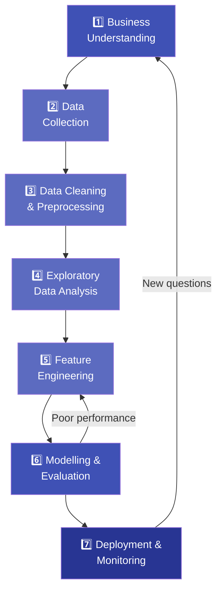

# 1.5 Data Science Life-Cycle

---

## Theory

The **Data Science Life-Cycle** describes the sequence of phases that a data science project follows — from defining the business problem to deploying and monitoring a solution.

---

### The Seven Stages



---

### Stage-by-Stage Breakdown

#### Stage 1 — Business Understanding
- Define the problem statement clearly
- Identify the business goal and success metric
- Understand available resources and constraints
- Example: *"Reduce customer churn by 15% in Q3"*

#### Stage 2 — Data Collection
- Identify data sources: databases, APIs, surveys, web scraping, sensors
- Ensure data covers the required time range and features
- Document provenance (where the data came from)

#### Stage 3 — Data Cleaning & Preprocessing
- Handle missing values (imputation or deletion)
- Remove or treat outliers
- Resolve inconsistent formats (e.g., date formats)
- Encode categorical variables
- Normalise / standardise numerical features

!!! warning "Time Investment"
    This stage consumes **60–80% of total project time**.

#### Stage 4 — Exploratory Data Analysis (EDA)
- Compute descriptive statistics (mean, median, std)
- Visualise distributions (histograms, box plots)
- Identify correlations and patterns
- Generate hypotheses to test

#### Stage 5 — Feature Engineering
- Create new informative features from existing ones
- Select the most relevant features (feature selection)
- Dimensionality reduction if needed (PCA)

#### Stage 6 — Modelling & Evaluation
- Choose an appropriate ML algorithm
- Split data into training and test sets
- Train the model and tune hyperparameters
- Evaluate using metrics (accuracy, RMSE, F1-score)

#### Stage 7 — Deployment & Monitoring
- Package the model as an API or microservice
- Integrate with the production application
- Monitor model performance over time
- Retrain when performance degrades (concept drift)

---

### Time Distribution Across Stages

| Stage | Typical Time Spent |
|-------|--------------------|
| Data Collection | 10–15% |
| Data Cleaning & Preprocessing | **60–80%** |
| EDA | 5–10% |
| Feature Engineering | 5–10% |
| Modelling | 5–10% |
| Evaluation & Deployment | 5% |

---

### Python Program — Life-Cycle Simulation

```python linenums="1" title="lifecycle_demo.py"
# Program : Data Science Life-Cycle Simulation
# Topic   : 1.5 Data Science Life-Cycle
# Author  : BT255CO Lecture Notes

import pandas as pd
import numpy as np
from sklearn.model_selection import train_test_split
from sklearn.linear_model import LinearRegression
from sklearn.metrics import mean_squared_error, r2_score

np.random.seed(0)

# =============================================
# STAGE 1: Business Understanding
# =============================================
print("STAGE 1 — Business Understanding")
print("Goal: Predict student exam scores from study hours.")
print()

# =============================================
# STAGE 2: Data Collection
# =============================================
print("STAGE 2 — Data Collection")
hours   = np.random.uniform(1, 10, 50)
noise   = np.random.normal(0, 5, 50)
scores  = 8 * hours + 20 + noise          # approximate linear relationship
df      = pd.DataFrame({"hours": hours, "score": scores})
print(f"  Collected {len(df)} records.\n")

# =============================================
# STAGE 3: Cleaning & Preprocessing
# =============================================
print("STAGE 3 — Data Cleaning & Preprocessing")
# Introduce a missing value and clean it
df.loc[5, "score"] = np.nan
print(f"  Missing values before: {df.isnull().sum().sum()}")
df["score"].fillna(df["score"].median(), inplace=True)
print(f"  Missing values after:  {df.isnull().sum().sum()}\n")

# =============================================
# STAGE 4: EDA
# =============================================
print("STAGE 4 — Exploratory Data Analysis")
print(df.describe().round(2))
print(f"\n  Correlation (hours vs score): "
      f"{df['hours'].corr(df['score']):.3f}\n")

# =============================================
# STAGE 5: Feature Engineering
# =============================================
print("STAGE 5 — Feature Engineering")
df["hours_squared"] = df["hours"] ** 2   # polynomial feature
print(f"  Added feature: hours_squared\n")

# =============================================
# STAGE 6: Modelling & Evaluation
# =============================================
print("STAGE 6 — Modelling & Evaluation")
X = df[["hours"]]
y = df["score"]

X_train, X_test, y_train, y_test = train_test_split(
    X, y, test_size=0.2, random_state=42
)

model = LinearRegression()
model.fit(X_train, y_train)
y_pred = model.predict(X_test)

rmse = mean_squared_error(y_test, y_pred, squared=False)
r2   = r2_score(y_test, y_pred)
print(f"  RMSE : {rmse:.2f}")
print(f"  R²   : {r2:.3f}\n")

# =============================================
# STAGE 7: Deployment Simulation
# =============================================
print("STAGE 7 — Deployment")
new_student = pd.DataFrame({"hours": [7.5]})
predicted_score = model.predict(new_student)[0]
print(f"  A student who studies 7.5 hours is predicted to score: "
      f"{predicted_score:.1f}/100")
```

**Output:**
```
STAGE 1 — Business Understanding
Goal: Predict student exam scores from study hours.

STAGE 2 — Data Collection
  Collected 50 records.

STAGE 3 — Data Cleaning & Preprocessing
  Missing values before: 1
  Missing values after:  0

STAGE 4 — Exploratory Data Analysis
         hours      score
count    50.00      50.00
mean      5.54      64.33
std       2.67      22.17
min       1.06      28.45
25%       3.29      47.30
50%       5.54      65.37
75%       8.01      83.06
max       9.95      99.89

  Correlation (hours vs score): 0.961

STAGE 5 — Feature Engineering
  Added feature: hours_squared

STAGE 6 — Modelling & Evaluation
  RMSE : 4.87
  R²   : 0.954

STAGE 7 — Deployment
  A student who studies 7.5 hours is predicted to score: 80.4/100
```

**Line-by-Line Explanation:**

| Line(s) | Code | Explanation |
|---------|------|-------------|
| 21–24 | `np.random.uniform(...)` | Generates synthetic continuous data (study hours) uniformly distributed between 1 and 10 |
| 23 | `noise = np.random.normal(0, 5, 50)` | Adds random Gaussian noise to simulate real-world variation |
| 24 | `scores = 8 * hours + 20 + noise` | Creates a **linear relationship** with slope 8 and intercept 20 |
| 31 | `df.loc[5, "score"] = np.nan` | Manually inserts a missing value to simulate data quality issues |
| 33 | `fillna(df["score"].median())` | Fills missing values with the **median** (robust to outliers, unlike mean) |
| 37 | `df.describe()` | Computes count, mean, std, min, percentiles, max for all numeric columns |
| 38 | `df['hours'].corr(df['score'])` | Pearson correlation: how closely two variables move together |
| 44 | `df["hours_squared"]` | Feature Engineering: adding a polynomial feature can help capture non-linear patterns |
| 52–53 | `train_test_split(...)` | Splits data so 80% is used for training and 20% for testing |
| 55–57 | `LinearRegression().fit(...)` | Creates and trains the model — it learns the slope and intercept |
| 59 | `mean_squared_error(..., squared=False)` | RMSE = root of mean squared errors; lower is better |
| 60 | `r2_score(...)` | R² close to 1.0 = excellent fit; negative = worse than a simple mean prediction |

---

## Summary

!!! success "Key Takeaways"
    - The Data Science Life-Cycle has **7 stages**: Business Understanding → Collection → Cleaning → EDA → Feature Engineering → Modelling → Deployment
    - Data Cleaning takes **60–80%** of total project time
    - The process is **iterative** — poor model results send you back to earlier stages
    - A model is only useful when **deployed** — a notebook result is not a product

---

## Review Questions

1. List the seven stages of the Data Science Life-Cycle.
2. Why does data cleaning take the most time in a typical project?
3. What is EDA and what kinds of insights does it provide?
4. What is Feature Engineering? Give two examples of engineered features.
5. What is concept drift and why does it require model retraining?

---

*Previous:* [← 1.4 Types of Data](1_4.md) &nbsp;|&nbsp; *Next:* [1.6 Collection, Cleaning & Preprocessing →](1_6.md)
