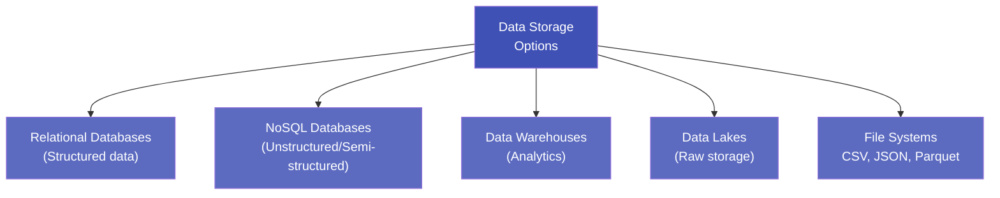

# 1.7 Storage and Retrieval

---

## Theory

After collecting and cleaning data, it must be stored efficiently so it can be retrieved, processed, and analysed quickly.

---

### Data Storage Options



---

### 1. Relational Databases (RDBMS)

| Feature | Details |
|---------|---------|
| Structure | Tables with rows and columns |
| Query Language | SQL (Structured Query Language) |
| Examples | MySQL, PostgreSQL, SQLite, Oracle |
| Best For | Structured transactional data |
| ACID Properties | Atomicity, Consistency, Isolation, Durability |

---

### 2. NoSQL Databases

| Type | Examples | Use Case |
|------|---------|---------|
| **Document** | MongoDB, CouchDB | JSON-like records (user profiles, logs) |
| **Key-Value** | Redis, DynamoDB | Caching, sessions |
| **Columnar** | Cassandra, HBase | Time-series, sensor data |
| **Graph** | Neo4j | Social networks, recommendation |

---

### 3. Data Warehouse vs. Data Lake

| Feature | Data Warehouse | Data Lake |
|---------|---------------|-----------|
| **Data type** | Structured only | Structured + unstructured |
| **Schema** | Schema-on-write (defined before loading) | Schema-on-read (defined when querying) |
| **Purpose** | BI and reporting | Exploration, ML, raw storage |
| **Cost** | Higher | Lower (cloud object storage) |
| **Examples** | Amazon Redshift, Snowflake | Amazon S3, Azure Data Lake, Hadoop HDFS |
| **Users** | Business analysts | Data scientists, engineers |

---

### 4. File Formats

| Format | Description | Best For |
|--------|-------------|---------|
| **CSV** | Plain text, comma-separated | Small datasets, portability |
| **JSON** | Key-value pairs, nested | APIs, semi-structured data |
| **Parquet** | Columnar binary format | Big data, analytics (very fast) |
| **HDF5** | Hierarchical Data Format | Scientific data, arrays |
| **Pickle** | Python-serialised objects | Saving ML models |

---

### SQL — Structured Query Language

The core SQL commands for data retrieval:

```sql
-- SELECT: retrieve data
SELECT name, age, salary
FROM employees
WHERE salary > 50000
ORDER BY salary DESC;

-- Aggregations
SELECT department, COUNT(*) AS headcount, AVG(salary) AS avg_salary
FROM employees
GROUP BY department
HAVING COUNT(*) > 5;

-- JOIN: combine tables
SELECT e.name, d.dept_name
FROM employees e
JOIN departments d ON e.dept_id = d.id;
```

---

### Python Program — SQLite Storage and Retrieval

```python linenums="1" title="storage_retrieval.py"
# Program : Data Storage and Retrieval with SQLite & Pandas
# Topic   : 1.7 Storage and Retrieval
# Author  : BT255CO Lecture Notes

import sqlite3
import pandas as pd

# -------------------------------------------------------
# 1. Create an in-memory SQLite database
# -------------------------------------------------------
conn = sqlite3.connect(":memory:")     # in-memory (no file needed)
cursor = conn.cursor()

# -------------------------------------------------------
# 2. Create a table
# -------------------------------------------------------
cursor.execute("""
    CREATE TABLE students (
        id      INTEGER PRIMARY KEY,
        name    TEXT    NOT NULL,
        age     INTEGER,
        cgpa    REAL,
        branch  TEXT
    )
""")

# -------------------------------------------------------
# 3. Insert records
# -------------------------------------------------------
students = [
    (1, "Alice",  20, 9.1, "CSE"),
    (2, "Bob",    21, 7.4, "ECE"),
    (3, "Carol",  19, 8.8, "CSE"),
    (4, "David",  22, 6.5, "Mech"),
    (5, "Eva",    20, 9.5, "CSE"),
]
cursor.executemany("INSERT INTO students VALUES (?, ?, ?, ?, ?)", students)
conn.commit()
print("Inserted 5 records into 'students' table.\n")

# -------------------------------------------------------
# 4. Retrieve all records using Pandas
# -------------------------------------------------------
df = pd.read_sql_query("SELECT * FROM students", conn)
print("All Students:")
print(df)
print()

# -------------------------------------------------------
# 5. SQL: Filter with WHERE
# -------------------------------------------------------
df_cse = pd.read_sql_query(
    "SELECT name, cgpa FROM students WHERE branch = 'CSE' ORDER BY cgpa DESC",
    conn
)
print("CSE Students (sorted by CGPA):")
print(df_cse)
print()

# -------------------------------------------------------
# 6. SQL: Aggregation with GROUP BY
# -------------------------------------------------------
df_agg = pd.read_sql_query(
    "SELECT branch, COUNT(*) as count, ROUND(AVG(cgpa), 2) as avg_cgpa "
    "FROM students GROUP BY branch",
    conn
)
print("Branch-wise Statistics:")
print(df_agg)
print()

# -------------------------------------------------------
# 7. Save DataFrame to CSV and read it back
# -------------------------------------------------------
df.to_csv("students.csv", index=False)
df_from_csv = pd.read_csv("students.csv")
print(f"Saved and reloaded from CSV: {len(df_from_csv)} rows")

conn.close()
```

**Output:**
```
Inserted 5 records into 'students' table.

All Students:
   id   name  age  cgpa branch
0   1  Alice   20   9.1    CSE
1   2    Bob   21   7.4    ECE
2   3  Carol   19   8.8    CSE
3   4  David   22   6.5   Mech
4   5    Eva   20   9.5    CSE

CSE Students (sorted by CGPA):
    name  cgpa
0    Eva   9.5
1  Alice   9.1
2  Carol   8.8

Branch-wise Statistics:
  branch  count  avg_cgpa
0    CSE      3      9.13
1    ECE      1      7.40
2   Mech      1      6.50

Saved and reloaded from CSV: 5 rows
```

**Line-by-Line Explanation:**

| Line(s) | Code | Explanation |
|---------|------|-------------|
| 11 | `sqlite3.connect(":memory:")` | Creates an in-memory SQLite database — no file is written to disk |
| 16–23 | `cursor.execute("CREATE TABLE ...")` | Runs a SQL DDL (Data Definition Language) statement to create the table structure |
| 30 | `cursor.executemany(...)` | Batch-inserts multiple rows in one call using a list of tuples |
| 31 | `conn.commit()` | Saves (commits) the transaction to the database |
| 34 | `pd.read_sql_query(...)` | Executes a SQL SELECT and returns the result directly as a DataFrame |
| 39–43 | `WHERE branch = 'CSE'` | SQL filter clause — retrieves only rows where branch is 'CSE' |
| 47–50 | `GROUP BY branch` | Aggregates rows by branch; `COUNT(*)` counts rows, `AVG(cgpa)` computes average |
| 54 | `df.to_csv("students.csv", index=False)` | Saves DataFrame to a CSV file; `index=False` omits the row numbers |
| 55 | `pd.read_csv("students.csv")` | Reads the CSV file back into a DataFrame |

---

## Summary

!!! success "Key Takeaways"
    - Data storage options include **RDBMS, NoSQL, Data Warehouses, Data Lakes, and File Systems**
    - **RDBMS** (e.g., MySQL, SQLite) are best for structured, transactional data
    - **Data Lakes** store raw data in any format; **Data Warehouses** store processed, structured data for analytics
    - **SQL** is the standard language for querying relational databases
    - Pandas integrates directly with SQL via `pd.read_sql_query()`
    - **Parquet** is the preferred format for large analytical datasets; **CSV** for portability

---

## Review Questions

1. Compare relational databases with NoSQL databases. When would you choose NoSQL over SQL?
2. What is the difference between a Data Warehouse and a Data Lake?
3. Write SQL queries to: (a) find all students with CGPA > 8.0, (b) count students per branch.
4. What are ACID properties in a database? Why are they important?
5. Name two file formats better than CSV for large datasets. What advantages do they offer?

---

*Previous:* [← 1.6 Collection, Cleaning & Preprocessing](1_6.md) &nbsp;|&nbsp; *Next:* [1.8 Methodologies →](1_8.md)
