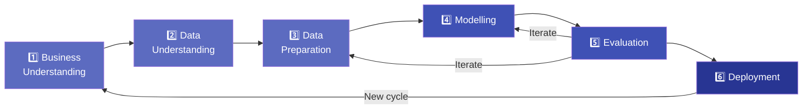

# 1.8 Common Methodologies — CRISP-DM and OSEMN

---

## Theory

Methodologies provide a **structured, repeatable process** for executing Data Science projects. The two most widely used are **CRISP-DM** and **OSEMN**.

---

## CRISP-DM

!!! note "Definition"
    **CRISP-DM** (Cross-Industry Standard Process for Data Mining) is a six-phase, industry-neutral methodology introduced in **1996**. It is the most widely adopted Data Science process framework.

### The Six Phases



| Phase | Key Tasks | Output |
|-------|-----------|--------|
| **1. Business Understanding** | Define goals, success criteria, project plan | Project charter |
| **2. Data Understanding** | Collect data, explore, describe, verify quality | Data quality report |
| **3. Data Preparation** | Select, clean, construct, integrate features | Analysis-ready dataset |
| **4. Modelling** | Select technique, build model, assess model | Trained model(s) |
| **5. Evaluation** | Evaluate vs. business goals, review process | Approved model |
| **6. Deployment** | Plan, monitor, produce final report | Deployed solution |

---

## OSEMN

!!! note "Definition"
    **OSEMN** (pronounced *"awesome"*) is a simpler, five-step framework introduced by Hilary Mason and Chris Wiggins in 2010. It is more code-centric and popular among practising data scientists.

### The Five Steps


| Step | Description |
|------|-------------|
| **O — Obtain** | Gather data from databases, APIs, files, scraping |
| **S — Scrub** | Clean, handle missing values, remove outliers, encode |
| **E — Explore** | EDA: plots, statistics, correlations, hypothesis generation |
| **M — Model** | Choose, train, tune, and validate ML models |
| **N — iNterpret** | Explain results, communicate insights, make decisions |

---

## CRISP-DM vs. OSEMN

| Aspect | CRISP-DM | OSEMN |
|--------|----------|-------|
| Origin | 1996, IBM/SAS/SPSS consortium | 2010, Hilary Mason & Chris Wiggins |
| Phases/Steps | 6 | 5 |
| Orientation | Business/management oriented | Practitioner/code oriented |
| Business phase | ✅ Explicit (Phase 1) | ❌ Not explicit |
| Deployment phase | ✅ Explicit (Phase 6) | ❌ Implied in iNterpret |
| Formality | More formal, documented | Informal, pragmatic |
| Best for | Structured enterprise projects | Academic / startup / quick analysis |

!!! tip "Which to use?"
    - Use **CRISP-DM** for enterprise projects with stakeholders, formal deliverables, and deployment requirements.
    - Use **OSEMN** for personal projects, competitions (Kaggle), research, or rapid prototyping.

---

### Python Program — OSEMN in Practice

```python linenums="1" title="osemn_demo.py"
# Program : OSEMN Framework Demonstration
# Topic   : 1.8 Methodologies — CRISP-DM & OSEMN
# Author  : BT255CO Lecture Notes

import pandas as pd
import numpy as np
from sklearn.linear_model import LinearRegression
from sklearn.model_selection import train_test_split
from sklearn.metrics import r2_score

# =========================================================
# O — OBTAIN: Load data
# =========================================================
print("=" * 55)
print("O — OBTAIN")
print("=" * 55)
np.random.seed(1)
n = 100
X_raw = np.random.uniform(1, 10, n)
y_raw = 5 * X_raw + 10 + np.random.normal(0, 3, n)

df = pd.DataFrame({"study_hours": X_raw, "exam_score": y_raw})
# Introduce issues
df.loc[0, "exam_score"] = np.nan
df.loc[10, "study_hours"] = 50    # outlier
print(f"Loaded {len(df)} records. Columns: {list(df.columns)}\n")

# =========================================================
# S — SCRUB: Clean data
# =========================================================
print("=" * 55)
print("S — SCRUB")
print("=" * 55)
# Remove outlier
df = df[df["study_hours"] <= 12]
# Fill missing
df["exam_score"].fillna(df["exam_score"].median(), inplace=True)
print(f"After scrubbing: {len(df)} records, 0 missing values.\n")

# =========================================================
# E — EXPLORE: Analyse data
# =========================================================
print("=" * 55)
print("E — EXPLORE")
print("=" * 55)
print(df.describe().round(2))
corr = df["study_hours"].corr(df["exam_score"])
print(f"\nCorrelation (study_hours vs exam_score): {corr:.3f}")
print("→ Strong positive correlation!\n")

# =========================================================
# M — MODEL: Build model
# =========================================================
print("=" * 55)
print("M — MODEL")
print("=" * 55)
X = df[["study_hours"]]
y = df["exam_score"]

X_train, X_test, y_train, y_test = train_test_split(
    X, y, test_size=0.2, random_state=42
)

model = LinearRegression()
model.fit(X_train, y_train)

print(f"Slope (coefficient): {model.coef_[0]:.2f}")
print(f"Intercept          : {model.intercept_:.2f}")
print(f"Equation           : score = {model.coef_[0]:.2f} × hours + "
      f"{model.intercept_:.2f}\n")

# =========================================================
# N — iNTERPRET: Draw conclusions
# =========================================================
print("=" * 55)
print("N — iNTERPRET")
print("=" * 55)
y_pred = model.predict(X_test)
r2     = r2_score(y_test, y_pred)
print(f"R² Score: {r2:.3f}")
print(f"→ The model explains {r2*100:.1f}% of the variance in exam scores.")
print()
print("Predictions for new students:")
new = pd.DataFrame({"study_hours": [3, 6, 9]})
preds = model.predict(new)
for h, p in zip([3, 6, 9], preds):
    print(f"  {h} hours studied → predicted score: {p:.1f}")
```

**Output:**
```
=======================================================
O — OBTAIN
=======================================================
Loaded 100 records. Columns: ['study_hours', 'exam_score']

=======================================================
S — SCRUB
=======================================================
After scrubbing: 99 records, 0 missing values.

=======================================================
E — EXPLORE
=======================================================
       study_hours  exam_score
count        99.00       99.00
mean          5.62       38.18
std           2.65       13.46
min           1.05       14.47
25%           3.22       26.17
50%           5.63       38.56
75%           7.97       50.31
max           9.97       61.23

Correlation (study_hours vs exam_score): 0.978
→ Strong positive correlation!

=======================================================
M — MODEL
=======================================================
Slope (coefficient): 4.96
Intercept          : 10.32
Equation           : score = 4.96 × hours + 10.32

=======================================================
N — iNTERPRET
=======================================================
R² Score: 0.963
→ The model explains 96.3% of the variance in exam scores.

Predictions for new students:
  3 hours studied → predicted score: 25.2
  6 hours studied → predicted score: 40.1
  9 hours studied → predicted score: 55.0
```

**Line-by-Line Explanation:**

| Line(s) | Code | Explanation |
|---------|------|-------------|
| 15–21 | O phase | Generates synthetic data and introduces data issues intentionally to simulate real-world messiness |
| 29–32 | S phase | Removes the outlier row (study hours > 12) using boolean filtering, then imputes the missing exam score |
| 38–41 | E phase | Computes descriptive statistics and Pearson correlation to understand the relationship between variables |
| 48–56 | M phase | Splits into train/test, trains a Linear Regression model, then extracts and prints the learned equation |
| 60 | `r2_score(y_test, y_pred)` | R² = fraction of variance explained; 0.963 means the model is very accurate |
| 63–65 | N phase | Applies the trained model to new unseen data to make predictions, interpreting the business meaning |

---

## Summary

!!! success "Key Takeaways"
    - **CRISP-DM** is the industry-standard 6-phase methodology: Business Understanding → Data Understanding → Data Preparation → Modelling → Evaluation → Deployment
    - **OSEMN** is a pragmatic 5-step framework: Obtain → Scrub → Explore → Model → iNterpret
    - Both are **iterative** — results from later stages feed back into earlier ones
    - CRISP-DM suits **enterprise projects**; OSEMN suits **quick, practitioner-focused** work
    - Following a methodology ensures **reproducibility, collaboration, and completeness**

---

## Review Questions

1. What does CRISP-DM stand for? List its six phases.
2. What does OSEMN stand for? Explain each step briefly.
3. Compare CRISP-DM and OSEMN on: origin, number of phases, and orientation.
4. Which phase of CRISP-DM maps to "Scrub" in OSEMN?
5. Why is it important to follow a methodology rather than working ad-hoc?

---

*Previous:* [← 1.7 Storage and Retrieval](1_7.md) &nbsp;|&nbsp; *Next:* [Unit 2 → Data Munging](../Unit2/index.md)
