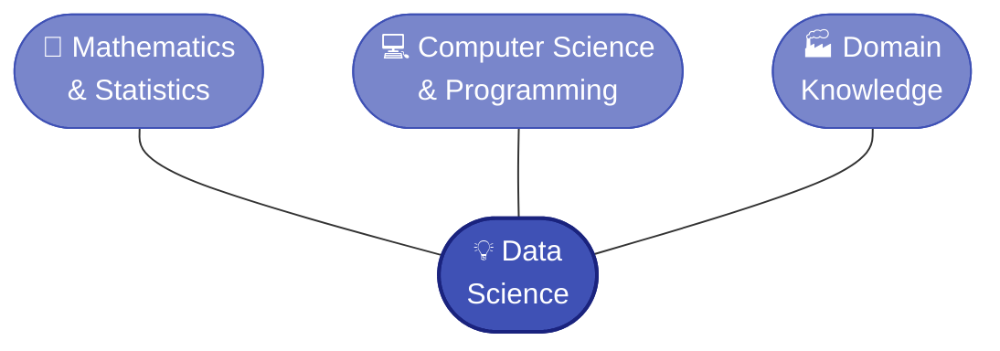
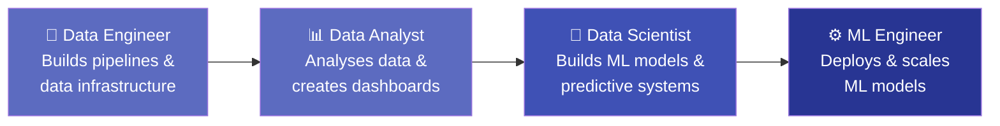

# 1.1 What is Data Science?

---

## Theory

### Definition

!!! note "Definition"
    **Data Science** is an interdisciplinary field that uses scientific methods, algorithms, processes, and systems to extract **knowledge and insights** from structured and unstructured data, and to apply that knowledge across a wide range of application domains.

Data Science sits at the intersection of three disciplines:



---

### Why is Data Science Important?

Every day, the world generates approximately **2.5 quintillion bytes** of data. Without the ability to process and analyse this data, it remains useless. Data Science transforms raw data into **actionable insights** that drive business decisions, scientific discovery, and policy-making.

!!! tip "Real-World Impact"
    - :hospital: **Healthcare** — predicting disease outbreaks, personalised medicine
    - :bank: **Finance** — fraud detection, credit scoring, algorithmic trading
    - :shopping_cart: **Retail** — recommendation engines (Netflix, Amazon)
    - :factory: **Manufacturing** — predictive maintenance, quality control
    - :car: **Transport** — self-driving cars, route optimisation

---

### Data Science vs. Related Fields

| Aspect | Data Science | Machine Learning | AI | Statistics |
|--------|-------------|------------------|----|------------|
| **Focus** | Full pipeline | Learning from data | Simulation of intelligence | Mathematical inference |
| **Key Output** | Insights + models | Predictive models | Intelligent agents | Hypothesis tests, estimates |
| **Tools** | Python, R, SQL | scikit-learn, TensorFlow | PyTorch, GPT | R, SPSS |
| **Scope** | Broad | Subset of AI | Broadest | Foundational |

---

### Roles in a Data Science Team



| Role | Responsibilities | Key Skills |
|------|-----------------|------------|
| **Data Engineer** | Data pipelines, ETL, data warehouses | SQL, Spark, Hadoop, Python |
| **Data Analyst** | Reports, dashboards, business insights | Excel, SQL, Tableau, Python |
| **Data Scientist** | Statistical models, ML models, experiments | Python, R, ML, Statistics |
| **ML Engineer** | Model deployment, APIs, MLOps | Python, Docker, Kubernetes, Cloud |

---

### The Data Science Lifecycle

The typical stages of a Data Science project are:

1. **Business Understanding** — Define the problem
2. **Data Collection** — Gather relevant data
3. **Data Cleaning** — Handle missing values, outliers
4. **Exploratory Analysis** — Understand patterns
5. **Feature Engineering** — Prepare input variables
6. **Modelling** — Train ML models
7. **Evaluation** — Measure model performance
8. **Deployment** — Integrate into production
9. **Monitoring** — Track real-world performance

---

## Examples

### Example 1 — Identifying a Data Science Problem

**Scenario:** An e-commerce company wants to reduce customer churn.

| Stage | Action |
|-------|--------|
| Business problem | Predict which customers are likely to stop purchasing |
| Data | Purchase history, browsing behaviour, demographics |
| Analysis | EDA on customer segments |
| Model | Logistic regression or Random Forest classifier |
| Output | Probability score for each customer's churn likelihood |

---

### Example 2 — Data Science vs. Traditional Analysis

=== "Traditional Analysis"
    - Analyst manually queries the database
    - Creates a monthly report in Excel
    - Describes **what happened** (descriptive analytics)

=== "Data Science Approach"
    - Automated pipeline collects data in real-time
    - ML model predicts **what will happen** (predictive analytics)
    - System recommends **what to do** (prescriptive analytics)

---

## Python Program — Hello Data Science

### Program

```python linenums="1" title="hello_data_science.py"
# Program: Introduction to Data Science with Python
# Topic:   1.1 What is Data Science?
# Author:  BT255CO Lecture Notes

import sys

def introduce_data_science():
    """Prints a structured introduction to Data Science."""
    print("=" * 55)
    print("   WELCOME TO BT255CO — INTRODUCTION TO DATA SCIENCE")
    print("=" * 55)

    topics = {
        "Unit 1": "Introduction to Data Science",
        "Unit 2": "Data Wrangling & Exploration",
        "Unit 3": "Machine Learning Basics",
    }

    print("\nCourse Syllabus:")
    for unit, description in topics.items():
        print(f"  {unit}: {description}")

    print(f"\nPython version: {sys.version}")
    print("\nKey Libraries Used in This Course:")

    libraries = ["numpy", "pandas", "matplotlib", "scikit-learn", "seaborn"]
    for lib in libraries:
        print(f"  ✔ {lib}")

    print("\nData Science = Statistics + Programming + Domain Knowledge")
    print("=" * 55)


if __name__ == "__main__":
    introduce_data_science()
```

### Output

```
=======================================================
   WELCOME TO BT255CO — INTRODUCTION TO DATA SCIENCE
=======================================================

Course Syllabus:
  Unit 1: Introduction to Data Science
  Unit 2: Data Wrangling & Exploration
  Unit 3: Machine Learning Basics

Python version: 3.11.0 (default, ...)

Key Libraries Used in This Course:
  ✔ numpy
  ✔ pandas
  ✔ matplotlib
  ✔ scikit-learn
  ✔ seaborn

Data Science = Statistics + Programming + Domain Knowledge
=======================================================
```

### Line-by-Line Explanation

| Line(s) | Code | Explanation |
|---------|------|-------------|
| 1–4 | Comments | Document the program's purpose, topic, and author |
| 6 | `import sys` | Imports the `sys` module to access Python version information |
| 8 | `def introduce_data_science():` | Defines a function — reusable block of code |
| 9 | `"""..."""` | Docstring — describes what the function does |
| 10 | `print("=" * 55)` | Prints `=` repeated 55 times as a decorative separator |
| 13–17 | `topics = {...}` | Creates a dictionary mapping unit names to descriptions |
| 19–21 | `for unit, description in topics.items():` | Iterates over key-value pairs in the dictionary |
| 23 | `sys.version` | Returns the current Python version string |
| 25–28 | `libraries = [...]` | Creates a list of library names |
| 29–30 | `for lib in libraries:` | Iterates over the list and prints each library |
| 33 | `if __name__ == "__main__":` | Ensures the function runs only when the script is executed directly |

---

## Summary

!!! success "Key Takeaways"
    - Data Science is the intersection of **statistics**, **programming**, and **domain knowledge**
    - It transforms raw data into **actionable insights**
    - Key roles include **Data Engineer**, **Data Analyst**, **Data Scientist**, and **ML Engineer**
    - The lifecycle includes data collection → cleaning → analysis → modelling → deployment
    - Python is the **primary language** for Data Science

---

## Exercises

!!! question "Practice Problems"

    1. List five real-world applications of Data Science in different industries.
    2. Distinguish between Data Science, Machine Learning, and Artificial Intelligence with examples.
    3. What skills should a Data Scientist have? Create a mind map.
    4. Identify the role (Data Engineer / Analyst / Scientist / ML Engineer) best suited for each task:
        - a) Building an ETL pipeline from a database to a data warehouse
        - b) Creating a monthly sales dashboard
        - c) Building a customer churn prediction model
        - d) Deploying a model as a REST API

---

## Review Questions

1. Define Data Science. How does it differ from traditional software development?
2. Explain the "Data Science Venn Diagram" and the significance of each intersection.
3. What is the difference between descriptive, predictive, and prescriptive analytics?
4. List the stages of the Data Science lifecycle and briefly describe each.
5. Why is domain knowledge considered essential in Data Science?

---

## References

1. Provost, F., & Fawcett, T. (2013). *Data Science for Business*. O'Reilly Media.
2. VanderPlas, J. (2016). *Python Data Science Handbook*. O'Reilly Media.
3. [What is Data Science? — IBM](https://www.ibm.com/topics/data-science)
4. [Data Science Overview — Towards Data Science](https://towardsdatascience.com/)

---

*Next:* [1.2 Data Types and Structures →](topic2.md)
