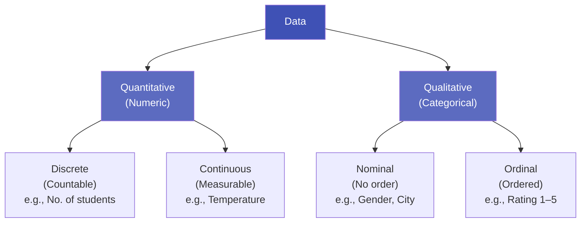

# 1.2 Data Types and Structures

---

## Theory

### Classification of Data

Data can be classified in two major ways:

1. **By measurement type** — Quantitative or Qualitative
2. **By structure** — Structured, Semi-structured, or Unstructured

---

### 1. Quantitative vs. Qualitative Data



| Type | Sub-type | Description | Example |
|------|----------|-------------|---------|
| **Quantitative** | Discrete | Whole, countable values | Students in a class: 30, 45 |
| **Quantitative** | Continuous | Any value within a range | Height: 5.7 ft, Temperature: 36.6°C |
| **Qualitative** | Nominal | Categories with no order | Gender (M/F), Blood type (A/B/O/AB) |
| **Qualitative** | Ordinal | Categories with a meaningful order | Education level: School < UG < PG < PhD |

!!! note "Memory Tip"
    - **Nominal** = "Name" only (no order)
    - **Ordinal** = "Order" matters

---

### 2. Structured vs. Unstructured Data

| Type | Definition | Example | % of World Data |
|------|-----------|---------|-----------------|
| **Structured** | Organised in rows and columns | Relational databases, Excel spreadsheets | ~20% |
| **Semi-structured** | Partially organised, has tags or markers | JSON, XML, HTML, email | ~15% |
| **Unstructured** | No fixed format | Images, video, audio, social media text | ~65% |

---

### 3. Scales of Measurement (Stevens, 1946)

| Scale | Properties | Operations Allowed | Example |
|-------|-----------|-------------------|---------|
| **Nominal** | Categories only | =, ≠ | Eye colour |
| **Ordinal** | Ordered categories | =, ≠, <, > | Customer satisfaction: Poor/Good/Excellent |
| **Interval** | Equal intervals, no true zero | +, − | Temperature in °C, IQ scores |
| **Ratio** | Equal intervals + true zero | +, −, ×, ÷ | Weight (kg), Age (years), Income |

!!! warning "Important Distinction"
    **0°C does not mean "no temperature"** — it is an arbitrary zero point. 
    In contrast, **0 kg means "no weight"** — a true zero. Therefore temperature in °C is 
    **interval** but weight is **ratio** scale.

---

### 4. Data Formats Encountered in Data Science

| Format | Description | Python Library |
|--------|-------------|---------------|
| CSV | Comma-separated values | `pandas` |
| JSON | Key-value pairs (nested) | `json`, `pandas` |
| Excel (.xlsx) | Spreadsheet | `openpyxl`, `pandas` |
| SQL Database | Relational tables | `sqlite3`, `sqlalchemy` |
| Images | Pixel arrays | `PIL`, `OpenCV` |
| Text | Raw strings, documents | `nltk`, `spacy` |
| Parquet / HDF5 | Columnar storage (big data) | `pyarrow`, `h5py` |

---

## Examples

### Example 1 — Classifying Variables in a Student Dataset

Consider this dataset:

| StudentID | Name  | Age | CGPA | Grade | City    |
|-----------|-------|-----|------|-------|---------|
| 101       | Alice | 20  | 8.5  | A     | Delhi   |
| 102       | Bob   | 21  | 7.2  | B     | Mumbai  |
| 103       | Carol | 19  | 9.1  | A+    | Kolkata |

| Variable | Type | Scale |
|----------|------|-------|
| StudentID | Qualitative – Nominal | Nominal (identifier, not numeric) |
| Name | Qualitative – Nominal | Nominal |
| Age | Quantitative – Discrete | Ratio |
| CGPA | Quantitative – Continuous | Ratio |
| Grade | Qualitative – Ordinal | Ordinal |
| City | Qualitative – Nominal | Nominal |

---

## Python Program — Exploring Data Types

### Program

```python linenums="1" title="data_types_demo.py"
# Program: Exploring Data Types with Python and Pandas
# Topic:   1.2 Data Types and Structures
# Author:  BT255CO Lecture Notes

import pandas as pd
import numpy as np

# -------------------------------------------------------
# 1. Create a sample student dataset
# -------------------------------------------------------
data = {
    "StudentID": [101, 102, 103, 104, 105],
    "Name":      ["Alice", "Bob", "Carol", "David", "Eva"],
    "Age":       [20, 21, 19, 22, 20],
    "CGPA":      [8.5, 7.2, 9.1, 6.8, 8.0],
    "Grade":     ["A", "B", "A+", "C", "A"],
    "City":      ["Delhi", "Mumbai", "Kolkata", "Delhi", "Chennai"]
}

df = pd.DataFrame(data)

# -------------------------------------------------------
# 2. Display the dataset
# -------------------------------------------------------
print("Dataset:")
print(df)
print()

# -------------------------------------------------------
# 3. Inspect data types
# -------------------------------------------------------
print("Data types of each column:")
print(df.dtypes)
print()

# -------------------------------------------------------
# 4. Summary statistics (only numeric columns)
# -------------------------------------------------------
print("Summary Statistics:")
print(df.describe())
print()

# -------------------------------------------------------
# 5. Count unique values in categorical columns
# -------------------------------------------------------
print("Unique cities:", df["City"].unique())
print("Unique grades:", df["Grade"].unique())
print()

# -------------------------------------------------------
# 6. Convert Grade to a Pandas Categorical (Ordinal)
# -------------------------------------------------------
grade_order = ["C", "B", "A", "A+"]
df["Grade"] = pd.Categorical(df["Grade"], categories=grade_order, ordered=True)

print("After converting Grade to Ordered Categorical:")
print(df["Grade"])
print(f"\nIs Grade ordinal? {df['Grade'].cat.ordered}")
print(f"Grade categories: {list(df['Grade'].cat.categories)}")
```

### Output

```
Dataset:
   StudentID   Name  Age  CGPA Grade     City
0        101  Alice   20   8.5     A    Delhi
1        102    Bob   21   7.2     B   Mumbai
2        103  Carol   19   9.1    A+  Kolkata
3        104  David   22   6.8     C    Delhi
4        105    Eva   20   8.0     A  Chennai

Data types of each column:
StudentID      int64
Name          object
Age            int64
CGPA         float64
Grade         object
City          object
dtype: object

Summary Statistics:
       StudentID        Age       CGPA
count    5.00000   5.000000   5.000000
mean   103.00000  20.400000   7.920000
std      1.58114   1.140175   0.870057
min    101.00000  19.000000   6.800000
25%    102.00000  20.000000   7.200000
50%    103.00000  20.000000   8.000000
75%    104.00000  21.000000   8.500000
max    105.00000  22.000000   9.100000

Unique cities: ['Delhi' 'Mumbai' 'Kolkata' 'Chennai']
Unique grades: ['A' 'B' 'A+' 'C']

After converting Grade to Ordered Categorical:
0     A
1     B
2    A+
3     C
4     A
Name: Grade, dtype: category

Is Grade ordinal? True
Grade categories: ['C', 'B', 'A', 'A+']
```

### Line-by-Line Explanation

| Line(s) | Code | Explanation |
|---------|------|-------------|
| 5–6 | `import pandas, numpy` | Import the pandas library (aliased as `pd`) and NumPy (aliased as `np`) |
| 11–19 | `data = {...}` | Creates a Python dictionary where each key is a column name and value is a list of data |
| 21 | `pd.DataFrame(data)` | Converts the dictionary into a **tabular DataFrame** — the central data structure in Pandas |
| 26 | `print(df)` | Displays the entire DataFrame in tabular form |
| 30 | `df.dtypes` | Returns the **data type** of each column as inferred by Pandas |
| 35 | `df.describe()` | Generates **summary statistics** (count, mean, std, min, max, quartiles) for numeric columns |
| 40 | `df["City"].unique()` | Returns an array of **unique values** in the "City" column |
| 46–47 | `pd.Categorical(...)` | Converts the Grade column into an **ordered categorical type**, enabling sorting and comparison |
| 50 | `df["Grade"].cat.ordered` | Checks whether the categorical variable has an ordering (`True` or `False`) |

---

## Summary

!!! success "Key Takeaways"
    - Data is classified as **Quantitative** (numeric) or **Qualitative** (categorical)
    - Quantitative data is **discrete** (countable) or **continuous** (measurable)
    - Qualitative data is **nominal** (no order) or **ordinal** (ordered)
    - The four measurement scales are **Nominal → Ordinal → Interval → Ratio**
    - ~65% of world data is **unstructured** (images, text, video)
    - Pandas uses `object`, `int64`, `float64`, and `category` dtypes to represent data

---

## Exercises

!!! question "Practice Problems"

    1. Classify the following as quantitative or qualitative, and give the measurement scale:
        - (a) Number of goals scored in a match
        - (b) Blood pressure reading (mmHg)
        - (c) Product rating (1–5 stars)
        - (d) PIN code of a city
        - (e) Monthly salary (₹)
    
    2. Given the following dataset, write Python code to:
        - Load it into a Pandas DataFrame
        - Print the data types of all columns
        - Calculate the mean and standard deviation of the "marks" column
        ```
        name,age,marks,grade
        Aarav,19,85,A
        Priya,20,72,B
        Rohan,21,90,A+
        Sneha,19,60,C
        ```
    
    3. What is the difference between semi-structured and unstructured data? Give two examples of each.

---

## Review Questions

1. What is the difference between discrete and continuous data? Give two examples of each.
2. Explain the four scales of measurement with examples from a student database.
3. Why is it important to identify the data type before performing analysis?
4. What percentage of the world's data is unstructured? What are the challenges of working with it?
5. How does Pandas represent ordinal data internally?

---

## References

1. Stevens, S. S. (1946). On the Theory of Scales of Measurement. *Science*, 103(2684).
2. McKinney, W. (2017). *Python for Data Analysis* (2nd ed.). O'Reilly Media.
3. [Pandas Documentation — Data Types](https://pandas.pydata.org/docs/user_guide/basics.html#dtypes)

---

*Previous:* [← 1.1 What is Data Science?](topic1.md) &nbsp;|&nbsp; *Next:* [1.3 The Data Science Process →](topic3.md)
