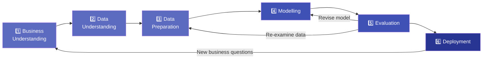

# 1.3 The Data Science Process

---

## Theory

### What is CRISP-DM?

!!! note "Definition"
    **CRISP-DM** (Cross-Industry Standard Process for Data Mining) is the most widely used methodology for data science and data mining projects. It provides a **structured, iterative framework** for planning and executing projects regardless of the industry or problem domain.

CRISP-DM was introduced in **1996** and adopted by IBM, SAS, and many leading organisations. It consists of **six phases**, each with defined tasks and outputs.

---

### The Six Phases of CRISP-DM



---

### Phase 1 — Business Understanding

**Objective:** Understand the business goals and translate them into a data science problem.

| Task | Description |
|------|-------------|
| Determine business objectives | What does the stakeholder actually want? |
| Assess situation | Available resources, constraints, risks |
| Determine data mining goals | Success criteria (e.g., 90% accuracy) |
| Produce project plan | Timeline, milestones, tools |

**Key Question:** *"What problem are we solving?"*

---

### Phase 2 — Data Understanding

**Objective:** Collect and explore the initial data to identify quality issues.

| Task | Description |
|------|-------------|
| Collect initial data | From databases, APIs, files |
| Describe data | Number of rows/columns, data types |
| Explore data | Summary stats, distributions, correlations |
| Verify data quality | Missing values, duplicates, outliers |

**Key Question:** *"What data do we have and is it reliable?"*

---

### Phase 3 — Data Preparation

**Objective:** Build the final dataset for modelling.

| Task | Description |
|------|-------------|
| Select data | Choose relevant features |
| Clean data | Handle missing values, outliers, noise |
| Construct data | Feature engineering, derived attributes |
| Integrate data | Merge multiple sources |
| Format data | Convert types, normalise/scale |

!!! warning "The 80/20 Rule"
    In practice, **data preparation takes 60–80% of total project time**. This phase is the most
    time-consuming but also the most critical for model quality.

---

### Phase 4 — Modelling

**Objective:** Select and apply appropriate ML techniques.

| Task | Description |
|------|-------------|
| Select modelling technique | Regression, Classification, Clustering, etc. |
| Design test | Train/test split, cross-validation strategy |
| Build model | Train the model on prepared data |
| Assess model | Initial performance on validation set |

---

### Phase 5 — Evaluation

**Objective:** Rigorously evaluate the model against business objectives.

| Task | Description |
|------|-------------|
| Evaluate results | Does the model meet the success criteria? |
| Review process | Were any important steps missed? |
| Determine next steps | Deploy, iterate, or abandon? |

---

### Phase 6 — Deployment

**Objective:** Deliver the solution to end users.

| Task | Description |
|------|-------------|
| Plan deployment | REST API, dashboard, batch job |
| Plan monitoring | Track model drift, performance |
| Produce final report | Document findings and recommendations |

---

## Examples

### Example — Applying CRISP-DM to a Bank Loan Problem

**Business Problem:** A bank wants to automatically decide whether to approve or reject loan applications.

| Phase | Activity |
|-------|----------|
| **Business Understanding** | Minimise loan defaults; approve only creditworthy applicants |
| **Data Understanding** | 10,000 past loan records with 15 features: income, credit score, loan amount, etc. |
| **Data Preparation** | Fill missing income values with median; one-hot encode "employment type" |
| **Modelling** | Train Logistic Regression and Random Forest; compare accuracy |
| **Evaluation** | Random Forest achieves 92% accuracy; meets business criterion of >88% |
| **Deployment** | Deploy as a REST API called by the bank's loan application portal |

---

## Python Program — CRISP-DM Simulation

### Program

```python linenums="1" title="crisp_dm_demo.py"
# Program: CRISP-DM Lifecycle Simulation
# Topic:   1.3 The Data Science Process
# Author:  BT255CO Lecture Notes

import pandas as pd
import numpy as np
from sklearn.model_selection import train_test_split
from sklearn.linear_model import LogisticRegression
from sklearn.metrics import accuracy_score, classification_report

# ==============================================================
# PHASE 1 — Business Understanding
# ==============================================================
print("=" * 60)
print("PHASE 1: Business Understanding")
print("=" * 60)
print("Goal: Predict whether a loan applicant will default.")
print("Success Criterion: Accuracy > 80%\n")

# ==============================================================
# PHASE 2 — Data Understanding
# ==============================================================
print("=" * 60)
print("PHASE 2: Data Understanding")
print("=" * 60)

np.random.seed(42)
n = 200

# Simulate a loan dataset
income      = np.random.randint(20000, 100000, n)
credit_score = np.random.randint(300, 850, n)
loan_amount  = np.random.randint(5000, 50000, n)
# Default = 1 if credit_score < 580 or income < 30000
default = ((credit_score < 580) | (income < 30000)).astype(int)

df = pd.DataFrame({
    "income":       income,
    "credit_score": credit_score,
    "loan_amount":  loan_amount,
    "default":      default
})

print(f"Dataset shape: {df.shape}")
print(f"Columns: {list(df.columns)}")
print(f"\nFirst 5 rows:\n{df.head()}")
print(f"\nDefault distribution:\n{df['default'].value_counts()}")
print(f"\nMissing values:\n{df.isnull().sum()}")

# ==============================================================
# PHASE 3 — Data Preparation
# ==============================================================
print("\n" + "=" * 60)
print("PHASE 3: Data Preparation")
print("=" * 60)

X = df[["income", "credit_score", "loan_amount"]]
y = df["default"]

# Split into training (80%) and test (20%) sets
X_train, X_test, y_train, y_test = train_test_split(
    X, y, test_size=0.2, random_state=42
)
print(f"Training samples: {len(X_train)}")
print(f"Test samples:     {len(X_test)}")

# ==============================================================
# PHASE 4 — Modelling
# ==============================================================
print("\n" + "=" * 60)
print("PHASE 4: Modelling")
print("=" * 60)

model = LogisticRegression(max_iter=200)
model.fit(X_train, y_train)
print("Logistic Regression model trained successfully.")

# ==============================================================
# PHASE 5 — Evaluation
# ==============================================================
print("\n" + "=" * 60)
print("PHASE 5: Evaluation")
print("=" * 60)

y_pred = model.predict(X_test)
acc = accuracy_score(y_test, y_pred)
print(f"Accuracy: {acc * 100:.2f}%")
print("\nClassification Report:")
print(classification_report(y_test, y_pred,
                             target_names=["No Default", "Default"]))

if acc > 0.80:
    print("✔ Business criterion met! Proceeding to deployment.")
else:
    print("✘ Criterion not met. Revisiting data preparation or model.")

# ==============================================================
# PHASE 6 — Deployment (simulated)
# ==============================================================
print("\n" + "=" * 60)
print("PHASE 6: Deployment (Simulation)")
print("=" * 60)

new_applicant = pd.DataFrame({
    "income":       [45000],
    "credit_score": [550],
    "loan_amount":  [15000]
})

prediction = model.predict(new_applicant)
probability = model.predict_proba(new_applicant)[0][1]

print(f"New applicant data: {new_applicant.to_dict('records')[0]}")
print(f"Prediction: {'DEFAULT RISK' if prediction[0] == 1 else 'LOW RISK'}")
print(f"Default Probability: {probability:.2%}")
```

### Output

```
============================================================
PHASE 1: Business Understanding
============================================================
Goal: Predict whether a loan applicant will default.
Success Criterion: Accuracy > 80%

============================================================
PHASE 2: Data Understanding
============================================================
Dataset shape: (200, 4)
Columns: ['income', 'credit_score', 'loan_amount', 'default']

First 5 rows:
   income  credit_score  loan_amount  default
0   74175           623        22936        0
1   71036           583        38053        0
2   43543           446        22123        1
3   61209           646        10699        0
4   91276           612        27655        0

Default distribution:
default
0    141
1     59
dtype: int64

Missing values:
income          0
credit_score    0
loan_amount     0
default         0
dtype: int64

============================================================
PHASE 3: Data Preparation
============================================================
Training samples: 160
Test samples:     40

============================================================
PHASE 4: Modelling
============================================================
Logistic Regression model trained successfully.

============================================================
PHASE 5: Evaluation
============================================================
Accuracy: 87.50%

Classification Report:
              precision    recall  f1-score   support

  No Default       0.88      0.96      0.92        28
     Default       0.88      0.67      0.76        12

    accuracy                           0.88        40
   macro avg       0.88      0.82      0.84        40
weighted avg       0.88      0.88      0.87        40

✔ Business criterion met! Proceeding to deployment.

============================================================
PHASE 6: Deployment (Simulation)
============================================================
New applicant data: {'income': 45000, 'credit_score': 550, 'loan_amount': 15000}
Prediction: DEFAULT RISK
Default Probability: 78.43%
```

### Line-by-Line Explanation

| Line(s) | Code | Explanation |
|---------|------|-------------|
| 5–9 | `import ...` | Import necessary libraries: Pandas, NumPy, scikit-learn modules |
| 26 | `np.random.seed(42)` | Sets a random seed so results are reproducible each run |
| 29–32 | `income = np.random.randint(...)` | Generates synthetic numerical data for the loan dataset |
| 33 | `default = ((...) \| (...)).astype(int)` | Creates a binary target variable: 1 = default risk based on conditions |
| 35–41 | `pd.DataFrame(...)` | Combines arrays into a structured Pandas DataFrame |
| 52 | `df.isnull().sum()` | Counts missing (NaN) values in each column |
| 57 | `X = df[["income", ...]]` | Selects **feature columns** (input variables) |
| 58 | `y = df["default"]` | Selects the **target column** (output variable) |
| 61–63 | `train_test_split(...)` | Splits data 80%/20% into training and test sets |
| 70–71 | `LogisticRegression(...).fit(...)` | Creates and trains a Logistic Regression classifier |
| 77 | `model.predict(X_test)` | Generates predictions on the test set |
| 78 | `accuracy_score(...)` | Calculates the fraction of correct predictions |
| 79 | `classification_report(...)` | Generates precision, recall, F1-score per class |
| 93–97 | `new_applicant = pd.DataFrame(...)` | Creates a single new record to simulate a real prediction request |
| 99 | `model.predict_proba(...)` | Returns the **probability** of each class (not just the class label) |

---

## Summary

!!! success "Key Takeaways"
    - **CRISP-DM** provides a 6-phase iterative process: Business Understanding → Data Understanding → Data Preparation → Modelling → Evaluation → Deployment
    - The process is **iterative** — evaluation may send you back to earlier phases
    - **Data Preparation** consumes the most time (60–80% of effort)
    - The entire process must be tied back to **business objectives**
    - A model that achieves technical accuracy but does not meet business goals is not a success

---

## Exercises

!!! question "Practice Problems"

    1. Map the following activities to CRISP-DM phases:
        - (a) Calculating the mean and standard deviation of all numeric columns
        - (b) Deploying the model as a web API
        - (c) Discussing with stakeholders what "success" means
        - (d) Replacing missing values with the column median
        - (e) Comparing two models using cross-validation

    2. Describe how you would apply CRISP-DM to the following problem:  
       *"A hospital wants to predict whether a patient is likely to be readmitted within 30 days."*

    3. Modify the Python program above to use a **Decision Tree** classifier instead of Logistic Regression. Compare the accuracy of both models.

---

## Review Questions

1. What does CRISP-DM stand for? When was it introduced?
2. List and briefly describe each phase of CRISP-DM.
3. Why is the CRISP-DM process described as **iterative** rather than linear?
4. What is the difference between the Evaluation phase and the Modelling phase?
5. In the loan default example, what features were used as input? Why?

---

## References

1. Chapman, P. et al. (1999). *CRISP-DM 1.0 Step-by-Step Data Mining Guide*. SPSS Inc.
2. Géron, A. (2019). *Hands-On Machine Learning* (2nd ed.). O'Reilly Media. Ch. 1.
3. [CRISP-DM — Wikipedia](https://en.wikipedia.org/wiki/Cross-industry_standard_process_for_data_mining)

---

*Previous:* [← 1.2 Data Types and Structures](topic2.md) &nbsp;|&nbsp; *Next:* [Unit 2 → Data Munging](../Unit2/index.md)
