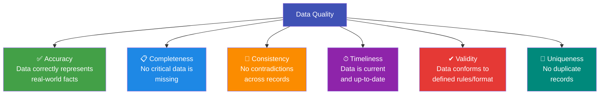

# 2.1 Data Quality

---

## Theory

!!! note "Definition"
    **Data Quality** refers to the degree to which data accurately, completely, and consistently represents the real-world entities or events it is intended to describe.

Poor data quality is the **#1 cause of failed data science projects**. The principle "Garbage In, Garbage Out" (GIGO) states that flawed input data always produces flawed output, regardless of how sophisticated the model is.

---

### The Six Dimensions of Data Quality



| Dimension | Description | Example of Violation |
|-----------|-------------|---------------------|
| **Accuracy** | Data correctly represents the truth | Age recorded as 250 years |
| **Completeness** | All required values are present | Customer record missing phone number |
| **Consistency** | No contradictions between fields | Date of birth is 2000, but age is listed as 50 |
| **Timeliness** | Data is current | Last year's customer addresses used for delivery |
| **Validity** | Data conforms to business rules and formats | Email without '@' symbol |
| **Uniqueness** | No duplicate records | Same customer entered twice in database |

---

### Data Quality Assessment in Python

```python linenums="1" title="data_quality.py"
# Program : Data Quality Assessment
# Topic   : 2.1 Data Quality
# Author  : BT255CO Lecture Notes

import pandas as pd
import numpy as np

# Sample dataset with quality issues
data = {
    "customer_id": [101, 102, 103, 102, 104, 105],       # 102 is duplicate
    "name":        ["Alice", "Bob", "Carol", "Bob", None, "Eva"],
    "age":         [25, 30, 250, 30, 28, -5],             # 250 and -5 invalid
    "email":       ["alice@mail.com", "bob@mail", "carol@mail.com",
                    "bob@mail", "eve@mail.com", "eva@mail.com"],  # 'bob@mail' invalid
    "salary":      [50000, 60000, None, 60000, 45000, 52000],
    "join_date":   ["2023-01-15", "2023-13-05", "2023-03-20",   # "2023-13-05" invalid
                    "2023-13-05", "2023-04-10", "2023-05-01"],
}

df = pd.DataFrame(data)
print("Raw Dataset:")
print(df)
print()

# -------------------------------------------------------
# 1. COMPLETENESS — check for missing values
# -------------------------------------------------------
missing       = df.isnull().sum()
missing_pct   = (missing / len(df) * 100).round(1)
print("Completeness Check (missing values):")
for col in df.columns:
    if missing[col] > 0:
        print(f"  ⚠ {col}: {missing[col]} missing ({missing_pct[col]}%)")
print()

# -------------------------------------------------------
# 2. UNIQUENESS — check for duplicates
# -------------------------------------------------------
dup_count = df.duplicated(subset=["customer_id"]).sum()
print(f"Uniqueness Check: {dup_count} duplicate customer_id(s) found")
print()

# -------------------------------------------------------
# 3. VALIDITY — check email format and age range
# -------------------------------------------------------
invalid_emails = df[~df["email"].str.contains("@.*\\.", regex=True, na=False)]
print(f"Validity Check — Invalid emails:")
print(invalid_emails[["customer_id", "email"]])
print()

invalid_ages = df[(df["age"] < 0) | (df["age"] > 120)]
print(f"Validity Check — Invalid age values:")
print(invalid_ages[["customer_id", "age"]])
print()

# -------------------------------------------------------
# 4. ACCURACY — check for invalid dates
# -------------------------------------------------------
def is_valid_date(d):
    try:
        pd.to_datetime(d, format="%Y-%m-%d")
        return True
    except:
        return False

df["date_valid"] = df["join_date"].apply(is_valid_date)
invalid_dates = df[~df["date_valid"]]
print("Accuracy Check — Invalid dates:")
print(invalid_dates[["customer_id", "join_date"]])
print()

# -------------------------------------------------------
# 5. Quality Score Summary
# -------------------------------------------------------
total_cells     = df.shape[0] * (df.shape[1] - 1)   # exclude date_valid col
missing_cells   = df.drop("date_valid", axis=1).isnull().sum().sum()
quality_score   = ((total_cells - missing_cells) / total_cells) * 100

print(f"Overall Completeness Score: {quality_score:.1f}%")
```

**Output:**
```
Raw Dataset:
   customer_id   name  age             email  salary   join_date
0          101  Alice   25  alice@mail.com   50000  2023-01-15
1          102    Bob   30       bob@mail   60000  2023-13-05
2          103  Carol  250  carol@mail.com     NaN  2023-03-20
3          102    Bob   30       bob@mail   60000  2023-13-05
4          104   None   28   eve@mail.com   45000  2023-04-10
5          105    Eva   -5    eva@mail.com   52000  2023-05-01

Completeness Check (missing values):
  ⚠ name: 1 missing (16.7%)
  ⚠ salary: 1 missing (16.7%)

Uniqueness Check: 1 duplicate customer_id(s) found

Validity Check — Invalid emails:
   customer_id     email
1          102  bob@mail
3          102  bob@mail

Validity Check — Invalid age values:
   customer_id  age
2          103  250
5          105   -5

Accuracy Check — Invalid dates:
   customer_id  join_date
1          102 2023-13-05
3          102 2023-13-05

Overall Completeness Score: 94.4%
```

**Line-by-Line Explanation:**

| Line(s) | Code | Explanation |
|---------|------|-------------|
| 22–23 | `df.isnull().sum()` | Counts `NaN` values per column; dividing by `len(df)` gives the percentage |
| 30 | `df.duplicated(subset=["customer_id"])` | Marks rows where `customer_id` has appeared before |
| 35 | `str.contains("@.*\\.", regex=True)` | Regex check: valid email must contain `@` followed by a `.` somewhere |
| 41 | `(df["age"] < 0) \| (df["age"] > 120)` | Boolean condition to find age values outside the valid human range |
| 47–51 | `is_valid_date(d)` | Custom function that tries to parse each date string; returns `False` if it raises an exception |
| 54 | `df["join_date"].apply(is_valid_date)` | Applies the function to every cell in the column |
| 59–61 | Quality Score | Measures completeness as the fraction of non-null cells |

---

## Summary

!!! success "Key Takeaways"
    - The six dimensions of data quality are: **Accuracy, Completeness, Consistency, Timeliness, Validity, Uniqueness**
    - Data quality issues must be **measured and reported** before cleaning begins
    - Use `isnull()`, `duplicated()`, and custom regex checks to assess quality
    - A **data quality score** helps quantify the extent of issues

---

## Review Questions

1. Define data quality. Why is it critical for Data Science?
2. Explain the six dimensions of data quality with one example each.
3. What is the "Garbage In, Garbage Out" principle?
4. How would you measure the completeness of a dataset programmatically?
5. Distinguish between validity and accuracy in data quality.

---

*Next:* [2.2 Common Issues with Real-World Data →](2_2.md)
