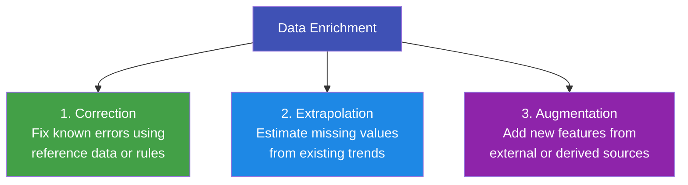

# 2.4 Data Enrichment

---

## Theory

!!! note "Definition"
    **Data Enrichment** is the process of enhancing, refining, or expanding existing data by adding, correcting, or extrapolating information from internal or external sources to increase its value for analysis.

Enriched data leads to **better models, richer insights, and more actionable results**.

---

### Why is Data Enrichment Needed?

| Reason | Description |
|--------|-------------|
| **Incomplete records** | Raw data often lacks important context |
| **Better predictions** | Additional features improve ML model accuracy |
| **Business context** | Adding demographic, geographic, or economic data provides richer insight |
| **Data fusion** | Combining internal data with external sources reveals hidden patterns |

---

### Three Methods of Data Enrichment



---

### 1. Correction

Correction uses **known reference data** or **business rules** to fix inaccuracies.

| Example | Correction Strategy |
|---------|-------------------|
| Wrong PIN code for a city | Replace using a PIN → city lookup table |
| Product category mislabelled | Use regex rules to re-classify |
| Name typos ("Dlhi" → "Delhi") | Fuzzy string matching + correction |

```python
# Correct misspelled city names using a reference mapping
city_corrections = {
    "dlhi":    "Delhi",
    "mumbi":   "Mumbai",
    "chenai":  "Chennai",
    "bangalor": "Bangalore",
}
df["city"] = df["city"].str.lower().replace(city_corrections)
```

---

### 2. Extrapolation

Extrapolation **estimates missing or future values** using patterns in the existing data.

| Type | Method | Use Case |
|------|--------|---------|
| **Linear Interpolation** | Estimate between known values | Fill gaps in time-series sensor data |
| **Polynomial Interpolation** | Curve-fit for non-linear trends | Stock price estimation |
| **Forward/Backward Fill** | Propagate last known value | Missing IoT readings |
| **Regression Imputation** | Predict missing values using other features | Impute income from age + education |

---

### 3. Augmentation

Augmentation **adds new data** from external sources or by creating derived features.

| Strategy | Description | Example |
|----------|-------------|---------|
| **External Data Joining** | Merge with third-party datasets | Add weather data to sales records |
| **Feature Engineering** | Derive new columns from existing ones | Extract day-of-week from date column |
| **Geocoding** | Convert addresses to lat/long coordinates | Map customer locations |
| **API Enrichment** | Enrich records via API calls | Append credit scores from a financial API |
| **Image Augmentation** | Generate variations of images | Flip, rotate, crop for ML training data |

---

### Python Program — All Three Enrichment Methods

```python linenums="1" title="data_enrichment.py"
# Program : Data Enrichment — Correction, Extrapolation, Augmentation
# Topic   : 2.4 Data Enrichment
# Author  : BT255CO Lecture Notes

import pandas as pd
import numpy as np

# -------------------------------------------------------
# Sample dataset with issues to enrich
# -------------------------------------------------------
data = {
    "date":    pd.date_range("2024-01-01", periods=8, freq="D"),
    "city":    ["dlhi", "mumbi", "Delhi", "mumbai", "chenai",
                "Bangalore", "bangalor", "Delhi"],
    "sales":   [1500, None, 1800, None, 2100, 1950, None, 2300],
    "temp_C":  [15.2, 28.4, None, 27.8, 30.1, None, 22.5, 16.0],
}

df = pd.DataFrame(data)
print("Original Data:")
print(df)
print()

# =========================================================
# 1. CORRECTION — fix city name typos
# =========================================================
corrections = {
    "dlhi": "Delhi", "mumbi": "Mumbai",
    "chenai": "Chennai", "bangalor": "Bangalore",
    "mumbai": "Mumbai"
}
df["city"] = df["city"].str.lower().replace(corrections).str.title()
print("After Correction (city names):")
print(df["city"].tolist())
print()

# =========================================================
# 2. EXTRAPOLATION — fill time-series gaps
# =========================================================
# Linear interpolation for temperature
df["temp_C"] = df["temp_C"].interpolate(method="linear")
print("After Interpolation (temperature, linear):")
print(df["temp_C"].tolist())
print()

# Forward fill for sales (last known value propagated)
df["sales"] = df["sales"].fillna(method="ffill")
print("After Forward Fill (sales):")
print(df["sales"].tolist())
print()

# =========================================================
# 3. AUGMENTATION — derive new features
# =========================================================
# Feature 1: Day of week
df["day_of_week"] = df["date"].dt.day_name()

# Feature 2: Is weekend?
df["is_weekend"] = df["date"].dt.dayofweek >= 5

# Feature 3: Temperature category
def categorise_temp(t):
    if t < 20:   return "Cold"
    elif t < 28: return "Comfortable"
    else:        return "Hot"

df["temp_category"] = df["temp_C"].apply(categorise_temp)

# Feature 4: Revenue estimate (augment with external average price per unit)
avg_price_per_unit = 150   # from external pricing database
df["revenue_est"] = df["sales"] * avg_price_per_unit

print("Fully Enriched Dataset:")
print(df[["date", "city", "sales", "temp_C", "day_of_week",
          "is_weekend", "temp_category", "revenue_est"]])
```

**Output:**
```
Original Data:
        date     city   sales  temp_C
0 2024-01-01     dlhi  1500.0    15.2
1 2024-01-02    mumbi     NaN    28.4
2 2024-01-03    Delhi  1800.0     NaN
3 2024-01-04   mumbai     NaN    27.8
4 2024-01-05   chenai  2100.0    30.1
5 2024-01-06  Bangalore  1950.0   NaN
6 2024-01-07  bangalor     NaN    22.5
7 2024-01-08    Delhi  2300.0    16.0

After Correction (city names):
['Delhi', 'Mumbai', 'Delhi', 'Mumbai', 'Chennai', 'Bangalore', 'Bangalore', 'Delhi']

After Interpolation (temperature, linear):
[15.2, 28.4, 28.1, 27.8, 30.1, 26.3, 22.5, 16.0]

After Forward Fill (sales):
[1500.0, 1500.0, 1800.0, 1800.0, 2100.0, 1950.0, 1950.0, 2300.0]

Fully Enriched Dataset:
        date       city   sales  temp_C day_of_week  is_weekend temp_category  revenue_est
0 2024-01-01      Delhi  1500.0    15.2      Monday       False          Cold       225000
1 2024-01-02     Mumbai  1500.0    28.4     Tuesday       False           Hot       225000
2 2024-01-03      Delhi  1800.0    28.1   Wednesday       False           Hot       270000
3 2024-01-04     Mumbai  1800.0    27.8    Thursday       False   Comfortable       270000
4 2024-01-05    Chennai  2100.0    30.1      Friday       False           Hot       315000
5 2024-01-06  Bangalore  1950.0    26.3    Saturday        True   Comfortable       292500
6 2024-01-07  Bangalore  1950.0    22.5      Sunday        True   Comfortable       292500
7 2024-01-08      Delhi  2300.0    16.0      Monday       False          Cold       345000
```

**Line-by-Line Explanation:**

| Line(s) | Code | Explanation |
|---------|------|-------------|
| 26–29 | `corrections` dict + `replace()` | Maps all observed misspellings to the correct city names in one step |
| 35 | `interpolate(method="linear")` | Estimates each `NaN` as a linearly interpolated value between its neighbours |
| 40 | `fillna(method="ffill")` | Forward Fill: propagates the last valid value forward to fill gaps |
| 45 | `dt.day_name()` | Extracts the full weekday name from a datetime column |
| 46 | `dt.dayofweek >= 5` | `dayofweek` returns 0=Monday ... 6=Sunday; `>= 5` means Saturday or Sunday |
| 48–52 | `categorise_temp()` | Custom function applied via `apply()` to derive a categorical temperature label |
| 56 | `sales * avg_price_per_unit` | Augments the dataset with a computed revenue column using an external price constant |

---

## Summary

!!! success "Key Takeaways"
    - **Correction** fixes known errors using reference data or rules
    - **Extrapolation** estimates missing values using trends (interpolation, forward-fill, regression)
    - **Augmentation** adds new value through derived features, external data merges, and API enrichment
    - Feature engineering (creating new columns from existing ones) is a key augmentation technique
    - Enriched data leads to higher model accuracy and richer business insights

---

## Review Questions

1. Define data enrichment. Why is it important in a real-world data science project?
2. Explain the difference between correction and augmentation with examples.
3. What is linear interpolation? When is it appropriate for filling missing values?
4. What is forward fill? In which type of data is it most appropriate?
5. Name four derived features you could create from a timestamp column. Write the Pandas code for each.

---

*Previous:* [← 2.3 Cleaning and Standardizing](2_3.md) &nbsp;|&nbsp; *Next:* [2.5 Data Validation →](2_5.md)
