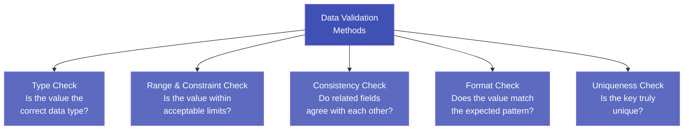

# 2.5 Data Validation

---

## Theory

!!! note "Definition"
    **Data Validation** is the process of checking that data conforms to a set of **predefined rules, formats, and constraints** before it is processed or stored. It is a proactive quality control step that catches bad data at the point of entry.

Data validation is different from data cleaning:
- **Cleaning** — fixes data after it has been collected
- **Validation** — prevents bad data from entering the system in the first place

---

### Common Methods of Data Validation



---

### 1. Type Check

Ensures a value is of the **expected data type**.

| Field | Expected Type | Invalid Value |
|-------|--------------|---------------|
| Age | Integer | "twenty-five" |
| Salary | Float/Integer | "N/A" |
| Email | String | 12345 |
| Enrolled | Boolean | "maybe" |

```python
# Type check example
try:
    age = int("twenty-five")   # will raise ValueError
except ValueError:
    print("Invalid: Age must be an integer")
```

---

### 2. Range and Constraint Check

Validates that values fall within **acceptable numerical or categorical limits**.

| Field | Constraint | Invalid Example |
|-------|-----------|-----------------|
| Age | 0 ≤ age ≤ 120 | age = 250 |
| CGPA | 0.0 ≤ cgpa ≤ 10.0 | cgpa = 11.5 |
| Gender | in {Male, Female, Other} | "xyz" |
| Month | 1 ≤ month ≤ 12 | month = 13 |

---

### 3. Consistency Check

Ensures that **related fields in the same record do not contradict each other**.

| Fields | Inconsistency |
|--------|--------------|
| Date of Birth + Age | DOB=2000 but Age=50 |
| Hire Date + Resignation Date | Resignation < Hire Date |
| Start Date + End Date | End < Start |
| Country=India but Phone prefix = +1 (USA) | Country and phone prefix mismatch |

---

### 4. Format Check

Validates that values match a **required pattern** (typically using regular expressions).

| Field | Valid Format | Regex Pattern |
|-------|-------------|--------------|
| Email | `user@domain.com` | `^[\w.-]+@[\w.-]+\.\w+$` |
| Phone | `+91XXXXXXXXXX` | `^\+91[6-9]\d{9}$` |
| Date | `YYYY-MM-DD` | `^\d{4}-\d{2}-\d{2}$` |
| PIN Code | 6-digit number | `^\d{6}$` |

---

### Python Program — Complete Validation Framework

```python linenums="1" title="data_validation.py"
# Program : Data Validation Framework
# Topic   : 2.5 Data Validation
# Author  : BT255CO Lecture Notes

import pandas as pd
import re
from datetime import datetime

# -------------------------------------------------------
# Sample dataset to validate
# -------------------------------------------------------
data = {
    "id":       [1, 2, 3, 4, 5],
    "name":     ["Alice", "Bob", "", "David", "Eva"],
    "age":      [25, 300, 30, -5, 22],
    "email":    ["alice@mail.com", "bob@mail", "carol@mail.com",
                 "david@mail.org", "notanemail"],
    "cgpa":     [8.5, 7.2, 11.0, 6.8, 9.1],
    "dob":      ["1999-01-15", "1994-06-30", "2000-03-20",
                 "2002-11-10", "2002-15-01"],      # last date invalid
    "hire_date":["2023-06-01", "2023-03-15", "2022-08-20",
                 "2024-01-10", "2023-09-05"],
    "resign_date":[None, "2023-01-01", None, None, None],   # Bob resigned before hire!
}

df = pd.DataFrame(data)
errors = []    # collect all validation errors

# =========================================================
# 1. TYPE CHECK — age must be integer-like
# =========================================================
for i, val in enumerate(df["age"]):
    try:
        int(val)
    except (ValueError, TypeError):
        errors.append(f"Row {i}: age '{val}' is not a valid integer")

# =========================================================
# 2. RANGE & CONSTRAINT CHECK
# =========================================================
# Age: 0–120
invalid_age = df[(df["age"] < 0) | (df["age"] > 120)]
for _, row in invalid_age.iterrows():
    errors.append(f"Row {row.name}: age={row['age']} out of range [0, 120]")

# CGPA: 0.0–10.0
invalid_cgpa = df[(df["cgpa"] < 0) | (df["cgpa"] > 10)]
for _, row in invalid_cgpa.iterrows():
    errors.append(f"Row {row.name}: cgpa={row['cgpa']} out of range [0, 10]")

# Name: must not be empty
empty_names = df[df["name"].str.strip() == ""]
for _, row in empty_names.iterrows():
    errors.append(f"Row {row.name}: name is empty")

# =========================================================
# 3. FORMAT CHECK — email validation using regex
# =========================================================
email_pattern = r"^[\w\.\-]+@[\w\.\-]+\.\w{2,}$"
for i, email in enumerate(df["email"]):
    if not re.match(email_pattern, str(email)):
        errors.append(f"Row {i}: email '{email}' has invalid format")

# =========================================================
# 4. FORMAT CHECK — date validation
# =========================================================
def is_valid_date(d):
    try:
        datetime.strptime(str(d), "%Y-%m-%d")
        return True
    except ValueError:
        return False

for i, dob in enumerate(df["dob"]):
    if not is_valid_date(dob):
        errors.append(f"Row {i}: dob '{dob}' is not a valid date (YYYY-MM-DD)")

# =========================================================
# 5. CONSISTENCY CHECK — resign_date must be >= hire_date
# =========================================================
for i, row in df.iterrows():
    if pd.notna(row["resign_date"]):
        h = pd.to_datetime(row["hire_date"])
        r = pd.to_datetime(row["resign_date"])
        if r < h:
            errors.append(
                f"Row {i}: resign_date ({row['resign_date']}) is "
                f"before hire_date ({row['hire_date']})"
            )

# =========================================================
# Report
# =========================================================
print("=" * 60)
print("DATA VALIDATION REPORT")
print("=" * 60)
if errors:
    print(f"\n❌ Found {len(errors)} validation error(s):\n")
    for err in errors:
        print(f"  • {err}")
else:
    print("\n✅ All records passed validation!")

print(f"\nTotal records checked: {len(df)}")
print(f"Records with errors  : {len(set(int(e.split()[1].rstrip(':')) for e in errors))}")
```

**Output:**
```
============================================================
DATA VALIDATION REPORT
============================================================

❌ Found 6 validation error(s):

  • Row 1: age=300 out of range [0, 120]
  • Row 3: age=-5 out of range [0, 120]
  • Row 2: cgpa=11.0 out of range [0, 10]
  • Row 2: name is empty
  • Row 1: email 'bob@mail' has invalid format
  • Row 4: email 'notanemail' has invalid format
  • Row 4: dob '2002-15-01' is not a valid date (YYYY-MM-DD)
  • Row 1: resign_date (2023-01-01) is before hire_date (2023-03-15)

Total records checked: 5
Records with errors  : 4
```

**Line-by-Line Explanation:**

| Line(s) | Code | Explanation |
|---------|------|-------------|
| 22 | `errors = []` | A list that accumulates all validation error messages throughout the script |
| 26–30 | Type check loop | Tries to convert each `age` value to an integer; catches `ValueError` for non-numeric inputs |
| 33–35 | Range check | Boolean mask selects rows where age is outside [0, 120]; iterates over them to log errors |
| 43–46 | Empty name check | `str.strip() == ""` catches names that are blank or only whitespace |
| 50–53 | Regex email check | `re.match(pattern, email)` returns `None` if the email doesn't match the pattern |
| 56–62 | Date format check | `datetime.strptime()` raises `ValueError` for any date string that doesn't match `YYYY-MM-DD` |
| 66–73 | Consistency check | Converts both dates to `datetime` objects and compares them to detect logical contradictions |
| 78 | Error reporting | Prints all collected errors after all checks are complete |

---

## Summary

!!! success "Key Takeaways"
    - Data Validation is **preventive** (at entry); Data Cleaning is **corrective** (after collection)
    - The four main validation methods are: **Type Check, Range/Constraint Check, Consistency Check, Format Check**
    - Regular expressions (`re`) are used for format validation (email, phone, date patterns)
    - Consistency checks catch logical contradictions **between** related fields in the same row
    - Always produce a **validation report** listing every error with its row and column

---

## Exercises

!!! question "Practice Problems"
    1. Write a Python function `validate_phone(phone)` that returns `True` if the phone number matches the format `+91XXXXXXXXXX` (10 digits after +91).
    2. Given a dataset with columns `birth_year` and `age`, write a consistency check that flags rows where `2024 - birth_year ≠ age` (allowing ±1 year difference).
    3. Write a range check that validates product prices are between ₹1 and ₹1,00,000.

---

## Review Questions

1. What is the difference between data validation and data cleaning?
2. Explain type check, range check, and consistency check with examples from a hospital patient dataset.
3. What is a regular expression? How is it used for format validation?
4. Design a validation rule set for a student registration form (fields: name, rollno, age, email, branch, cgpa).
5. Why is it better to validate data at the point of entry rather than during analysis?

---

*Previous:* [← 2.4 Data Enrichment](2_4.md) &nbsp;|&nbsp; *Next:* [Unit 3 → Statistical Analysis](../Unit3/index.md)
