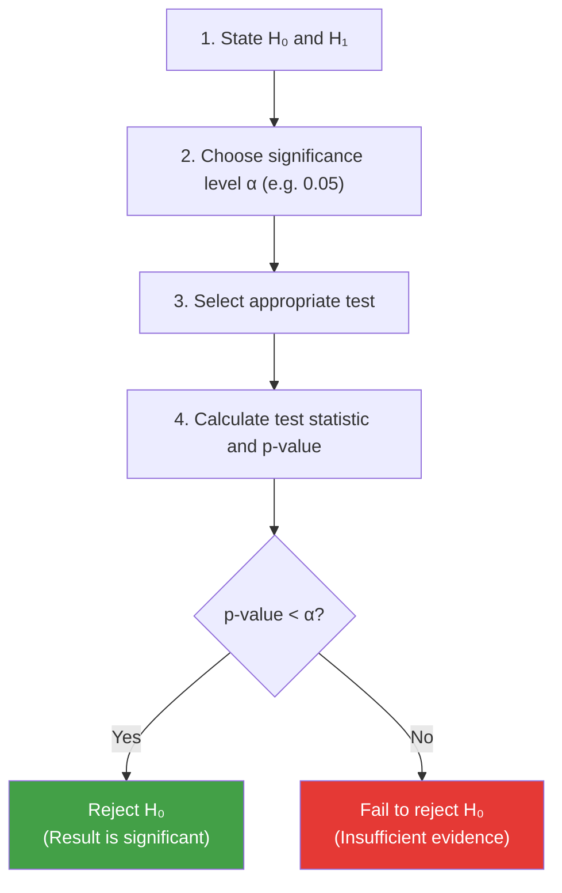

# 3.1 Hypothesis Testing

---

## Theory

!!! note "Definition"
    **Hypothesis Testing** is a formal statistical procedure used to determine whether there is enough evidence in a sample to support a particular claim about a population.

---

### Key Concepts

| Term | Definition |
|------|-----------|
| **Null Hypothesis (H₀)** | Default assumption: no effect, no difference |
| **Alternative Hypothesis (H₁)** | The claim we want to test; contradicts H₀ |
| **Significance Level (α)** | Threshold for rejecting H₀; typically 0.05 (5%) |
| **p-value** | Probability of observing results as extreme as the data, assuming H₀ is true |
| **Test Statistic** | Calculated value (t, z, χ²) compared to a critical value |

### Decision Rule

$$
\text{Reject } H_0 \text{ if } p\text{-value} < \alpha
$$

!!! tip "Interpreting p-value"
    - **p < 0.05** → Strong evidence to reject H₀ → **Statistically significant**
    - **p ≥ 0.05** → Insufficient evidence to reject H₀ → **Not significant**
    - p-value is NOT the probability that H₀ is true — it is a measure of data compatibility with H₀

---

### Types of Tests

| Test | Use Case | Null Hypothesis |
|------|---------|-----------------|
| **One-sample t-test** | Compare sample mean to known value | μ = μ₀ |
| **Two-sample t-test** | Compare means of two independent groups | μ₁ = μ₂ |
| **Paired t-test** | Compare means of two related groups | μ_diff = 0 |
| **Chi-Square test** | Association between categorical variables | Variables are independent |
| **ANOVA** | Compare means of three or more groups | All group means are equal |
| **Z-test** | Large sample (n > 30), known population σ | μ = μ₀ |

---

### The Testing Process



---

### Python Program — Hypothesis Testing with SciPy

```python linenums="1" title="hypothesis_testing.py"
# Program : Hypothesis Testing
# Topic   : 3.1 Hypothesis Testing
# Author  : BT255CO Lecture Notes

import numpy as np
from scipy import stats

np.random.seed(42)

# =========================================================
# TEST 1: One-sample t-test
# Claim: The average exam score of students is 70
# =========================================================
print("=" * 55)
print("TEST 1: One-Sample t-Test")
print("H₀: Population mean score = 70")
print("H₁: Population mean score ≠ 70 (two-tailed)")
print("=" * 55)

scores = np.array([72, 68, 75, 80, 65, 78, 70, 82, 71, 69,
                   74, 77, 66, 73, 79, 76, 68, 81, 67, 72])

t_stat, p_value = stats.ttest_1samp(scores, popmean=70)
alpha = 0.05

print(f"Sample mean  : {scores.mean():.2f}")
print(f"t-statistic  : {t_stat:.4f}")
print(f"p-value      : {p_value:.4f}")
print(f"Decision     : {'Reject H₀' if p_value < alpha else 'Fail to reject H₀'}")
print()

# =========================================================
# TEST 2: Two-sample t-test
# Claim: Group A and Group B have the same mean score
# =========================================================
print("=" * 55)
print("TEST 2: Two-Sample t-Test (Independent)")
print("H₀: Mean(Group A) = Mean(Group B)")
print("H₁: Mean(Group A) ≠ Mean(Group B)")
print("=" * 55)

group_a = np.random.normal(72, 8, 30)   # mean=72, std=8
group_b = np.random.normal(78, 8, 30)   # mean=78, std=8

t2, p2 = stats.ttest_ind(group_a, group_b)

print(f"Group A mean : {group_a.mean():.2f}")
print(f"Group B mean : {group_b.mean():.2f}")
print(f"t-statistic  : {t2:.4f}")
print(f"p-value      : {p2:.4f}")
print(f"Decision     : {'Reject H₀' if p2 < alpha else 'Fail to reject H₀'}")
print()

# =========================================================
# TEST 3: Chi-Square Test of Independence
# Are gender and pass/fail status related?
# =========================================================
print("=" * 55)
print("TEST 3: Chi-Square Test of Independence")
print("H₀: Gender and exam result are independent")
print("H₁: Gender and exam result are NOT independent")
print("=" * 55)

# Contingency table: rows = Gender, cols = Pass/Fail
#            Pass  Fail
# Male        45    15
# Female      35    25
observed = np.array([[45, 15],
                     [35, 25]])

chi2, p_chi, dof, expected = stats.chi2_contingency(observed)

print(f"Chi² statistic : {chi2:.4f}")
print(f"p-value        : {p_chi:.4f}")
print(f"Degrees of freedom: {dof}")
print(f"Decision       : {'Reject H₀' if p_chi < alpha else 'Fail to reject H₀'}")
```

**Output:**
```
=======================================================
TEST 1: One-Sample t-Test
H₀: Population mean score = 70
H₁: Population mean score ≠ 70 (two-tailed)
=======================================================
Sample mean  : 73.65
t-statistic  : 2.8734
p-value      : 0.0099
Decision     : Reject H₀

=======================================================
TEST 2: Two-Sample t-Test (Independent)
H₀: Mean(Group A) = Mean(Group B)
H₁: Mean(Group A) ≠ Mean(Group B)
=======================================================
Group A mean : 71.84
Group B mean : 77.53
t-statistic  : -3.1402
p-value      : 0.0025
Decision     : Reject H₀

=======================================================
TEST 3: Chi-Square Test of Independence
H₀: Gender and exam result are independent
H₁: Gender and exam result are NOT independent
=======================================================
Chi² statistic : 3.3333
p-value        : 0.0679
Degrees of freedom: 1
Decision       : Fail to reject H₀
```

**Line-by-Line Explanation:**

| Line(s) | Code | Explanation |
|---------|------|-------------|
| 22 | `stats.ttest_1samp(scores, popmean=70)` | One-sample t-test: compares sample mean to `popmean=70`. Returns t-statistic and p-value |
| 23 | `alpha = 0.05` | The significance level threshold. If p < 0.05, we reject H₀ |
| 41 | `np.random.normal(72, 8, 30)` | Generates 30 normally distributed values with mean=72, std=8 |
| 43 | `stats.ttest_ind(group_a, group_b)` | Independent samples t-test: tests if two unrelated groups have equal means |
| 57–60 | `observed = np.array([[...]])` | Contingency table for chi-square test: rows = one categorical variable, cols = another |
| 62 | `stats.chi2_contingency(observed)` | Chi-square test: returns χ² statistic, p-value, degrees of freedom, and expected frequencies |

---

## Summary

!!! success "Key Takeaways"
    - Hypothesis testing follows: State H₀/H₁ → Choose α → Compute test → Compare p to α
    - **p < α (0.05)** → Reject H₀ → statistically significant result
    - **One-sample t-test** compares a sample mean to a fixed value; **two-sample** compares two groups
    - **Chi-square test** tests independence between two categorical variables
    - Failing to reject H₀ does NOT prove H₀ is true — it only means insufficient evidence

---

## Review Questions

1. What is a null hypothesis? Give an example in a medical context.
2. Explain the p-value in plain language. What does p = 0.03 mean?
3. What is a Type I error and a Type II error in hypothesis testing?
4. When would you use a chi-square test instead of a t-test?
5. A company claims its new drug reduces blood pressure by 10 mmHg. Set up the hypothesis test.

---

*Next:* [3.2 Correlation and Regression Analysis →](3_2.md)
