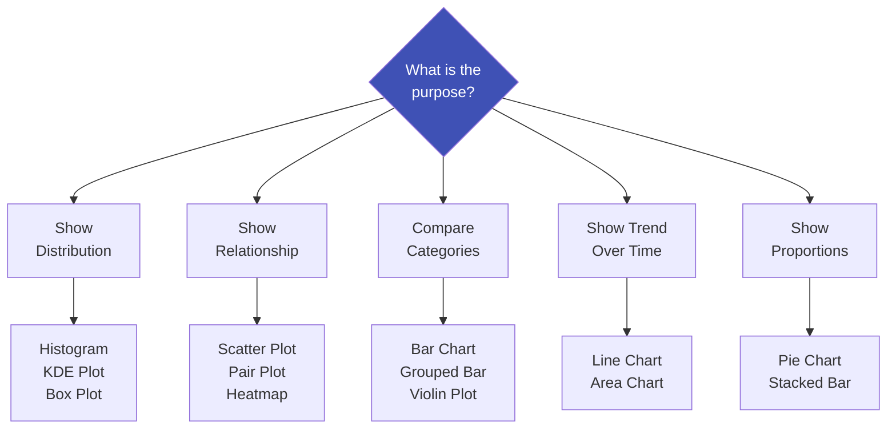

# 5.1 Exploring Data Through Graphs and Charts

---

## Theory

Choosing the right chart is as important as the analysis itself. The wrong chart can mislead or obscure insights.

### Chart Selection Guide



---

### Python Program — Advanced Visualization Techniques

```python linenums="1" title="advanced_viz.py"
# Program : Advanced Data Visualization
# Topic   : 5.1 Exploring Data Through Graphs and Charts
# Author  : BT255CO Lecture Notes

import numpy as np
import pandas as pd
import matplotlib.pyplot as plt
import matplotlib.dates as mdates
import seaborn as sns

np.random.seed(0)
sns.set_theme(style="ticks", palette="muted")

# -------------------------------------------------------
# Dataset
# -------------------------------------------------------
n = 200
df = pd.DataFrame({
    "study_hours":  np.random.uniform(1, 10, n),
    "sleep_hours":  np.random.uniform(4, 9, n),
    "branch":       np.random.choice(["CSE", "ECE", "Mech"], n),
    "gender":       np.random.choice(["Male", "Female"], n),
    "attendance":   np.random.randint(60, 100, n),
})
df["score"] = (7*df["study_hours"] + 3*df["sleep_hours"]
               + 0.3*df["attendance"] + np.random.normal(0, 5, n)).clip(0, 100)

# =========================================================
# 1. Pair Plot — relationships between all numeric pairs
# =========================================================
pairplot_cols = ["study_hours", "sleep_hours", "attendance", "score"]
pair_df = df[pairplot_cols + ["branch"]]

g = sns.pairplot(pair_df, hue="branch", diag_kind="kde",
                  plot_kws={"alpha": 0.5})
g.figure.suptitle("Pair Plot — All Feature Relationships", y=1.02)
plt.savefig("../images/pair_plot.png", dpi=100, bbox_inches="tight")
plt.close()
print("Pair plot saved.")

# =========================================================
# 2. Multi-panel chart (2×2)
# =========================================================
fig, axes = plt.subplots(2, 2, figsize=(13, 10))
fig.suptitle("Multi-Panel Visualization", fontsize=14)

# Panel A: KDE plot by branch
for branch in df["branch"].unique():
    subset = df[df["branch"] == branch]["score"]
    axes[0, 0].plot(np.sort(subset),
                     np.linspace(0, 1, len(subset)),
                     label=branch)
axes[0, 0].set_title("CDF — Score by Branch")
axes[0, 0].set_xlabel("Score")
axes[0, 0].legend()

# Panel B: Grouped bar chart
branch_gender = df.groupby(["branch", "gender"])["score"].mean().unstack()
branch_gender.plot(kind="bar", ax=axes[0, 1], color=["#5c6bc0", "#ef9a9a"],
                   edgecolor="white", rot=0)
axes[0, 1].set_title("Mean Score by Branch & Gender")
axes[0, 1].set_ylabel("Mean Score")
axes[0, 1].legend(title="Gender")

# Panel C: Scatter with colour and size encoding
scatter = axes[1, 0].scatter(
    df["study_hours"], df["score"],
    c=df["attendance"], cmap="YlOrRd",
    s=df["sleep_hours"] * 10, alpha=0.6
)
plt.colorbar(scatter, ax=axes[1, 0], label="Attendance %")
axes[1, 0].set_title("Scatter (colour=attendance, size=sleep)")
axes[1, 0].set_xlabel("Study Hours")
axes[1, 0].set_ylabel("Score")

# Panel D: Time series (monthly average)
dates = pd.date_range("2024-01-01", periods=12, freq="ME")
monthly_avg = np.array([62, 65, 68, 71, 70, 74, 77, 75, 78, 80, 82, 85])
axes[1, 1].plot(dates, monthly_avg, marker="o", color="#3f51b5", linewidth=2)
axes[1, 1].fill_between(dates, monthly_avg, alpha=0.15, color="#3f51b5")
axes[1, 1].xaxis.set_major_formatter(mdates.DateFormatter("%b"))
axes[1, 1].set_title("Time Series — Monthly Average Score")
axes[1, 1].set_ylabel("Score")

plt.tight_layout()
plt.savefig("../images/multi_panel.png", dpi=150, bbox_inches="tight")
plt.close()
print("Multi-panel chart saved.")

# =========================================================
# 3. Statistical summary visualisation
# =========================================================
fig, axes = plt.subplots(1, 2, figsize=(12, 5))

# Swarm + Box combined
sns.boxplot(data=df, x="branch", y="score",
            palette="Set2", ax=axes[0], width=0.4)
sns.stripplot(data=df, x="branch", y="score",
               size=3, alpha=0.4, color="black", ax=axes[0])
axes[0].set_title("Box + Strip Plot — Score by Branch")

# Count plot
sns.countplot(data=df, x="branch", hue="gender",
               palette="muted", ax=axes[1])
axes[1].set_title("Count Plot — Students by Branch & Gender")
axes[1].legend(title="Gender")

plt.tight_layout()
plt.savefig("../images/stats_viz.png", dpi=150, bbox_inches="tight")
plt.close()
print("Statistical visualization saved.")
```

**Key Code Explanations:**

| Code | Explanation |
|------|-------------|
| `sns.pairplot(hue="branch")` | Creates scatter plots for every feature pair, coloured by category; diagonal shows KDE |
| `df.groupby(["branch","gender"])["score"].mean().unstack()` | Pivot: rows=branch, cols=gender; `.plot(kind="bar")` makes grouped bars |
| `scatter = axes.scatter(..., c=attendance, cmap="YlOrRd")` | Encodes a third variable as colour gradient using a colormap |
| `fill_between(dates, monthly_avg, alpha=0.15)` | Fills area under a line — good for time-series trend emphasis |
| `mdates.DateFormatter("%b")` | Formats x-axis date tick labels as month abbreviations |
| `sns.stripplot(...)` | Overlays individual data points on a box plot for full transparency |

---

## Summary

!!! success "Key Takeaways"
    - Match chart type to purpose: distribution → histogram/box, relationship → scatter, trend → line
    - **Pair plots** reveal all pairwise relationships and distributions in one figure
    - **Colour and size** can encode additional variables in scatter plots (multi-dimensional visualisation)
    - Time-series plots benefit from filled areas and proper date formatting
    - **Strip plots** over box plots show individual data points, avoiding hiding sample size

---

## Review Questions

1. When should you use a line chart vs. a bar chart?
2. What information does a pair plot provide that individual scatter plots cannot?
3. In a scatter plot, what visual encodings can you use to represent a third variable?
4. Why is a violin plot considered more informative than a box plot?
5. What is the difference between a histogram and a KDE plot?

---

*Next:* [5.2 Interactive Visualization Tools →](5_2.md)
