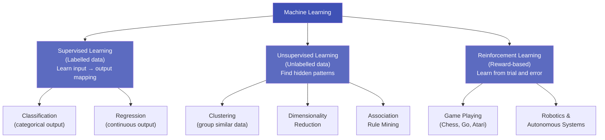

# 6.1 Types of Machine Learning

---

## Theory

!!! note "Definition"
    **Machine Learning (ML)** is a subset of Artificial Intelligence in which a computer system learns to perform a task by **finding patterns in data**, without being explicitly programmed with rules.

---

### The Three Main Types



---

### 1. Supervised Learning

- **Training data:** Labelled (each input has a known correct output)
- **Goal:** Learn a function $f(x) \rightarrow y$
- **Sub-types:**
    - **Regression** — output is continuous (e.g., predict house price)
    - **Classification** — output is a category (e.g., spam/not-spam)
- **Examples:** Linear Regression, Logistic Regression, Decision Trees, SVM, Neural Networks

| Task | Input (X) | Output (Y) |
|------|-----------|-----------|
| Predict salary | Age, experience, education | Salary (₹) |
| Email classification | Email text features | Spam / Not Spam |
| Handwriting recognition | Pixel values | Digit (0–9) |
| Medical diagnosis | Patient vitals | Disease (Yes/No) |

---

### 2. Unsupervised Learning

- **Training data:** Unlabelled (no correct output is provided)
- **Goal:** Discover hidden structure or patterns
- **Sub-types:**
    - **Clustering** — group similar data points (K-Means, Hierarchical)
    - **Dimensionality Reduction** — reduce number of features (PCA)
    - **Association Rules** — find items frequently purchased together (Apriori)
- **Examples:** K-Means, DBSCAN, PCA, Apriori, Autoencoders

| Task | Input | Output |
|------|-------|--------|
| Customer segmentation | Purchase history | Groups of similar customers |
| Topic modelling | News articles | Latent topics |
| Anomaly detection | Transaction data | Normal / Anomalous |
| Image compression | High-res images | Compressed representations |

---

### 3. Reinforcement Learning

- **Training data:** No fixed dataset — agent learns by interacting with an **environment**
- **Goal:** Maximise cumulative **reward** over time
- **Key concepts:** Agent, Environment, State, Action, Reward, Policy
- **Examples:** AlphaGo, OpenAI Gym, self-driving car controllers, recommendation systems

```
Agent → takes Action → Environment changes State → gives Reward → Agent updates Policy
```

---

### Comparison Table

| Aspect | Supervised | Unsupervised | Reinforcement |
|--------|-----------|-------------|---------------|
| Data required | Labelled | Unlabelled | Interaction/simulation |
| Output | Prediction | Pattern/group | Policy/action |
| Feedback | Explicit (label) | None | Reward signal |
| Complexity | Medium | Medium-high | Very high |
| Example | Spam detection | Customer segmentation | AlphaGo |

---

### Python Program — Quick Demo of All Three Types

```python linenums="1" title="ml_types.py"
# Program : Types of Machine Learning
# Topic   : 6.1 Types of Machine Learning
# Author  : BT255CO Lecture Notes

import numpy as np
from sklearn.linear_model import LogisticRegression
from sklearn.cluster import KMeans
from sklearn.datasets import make_classification, make_blobs

np.random.seed(42)

# =========================================================
# 1. SUPERVISED LEARNING — Classification
# =========================================================
print("=" * 50)
print("1. SUPERVISED LEARNING (Classification)")
print("=" * 50)

X_sup, y_sup = make_classification(
    n_samples=200, n_features=4, n_informative=3,
    n_redundant=1, random_state=42
)

model = LogisticRegression(max_iter=200)
model.fit(X_sup, y_sup)
train_acc = model.score(X_sup, y_sup)

print(f"  Dataset  : 200 samples, 4 features, 2 classes")
print(f"  Algorithm: Logistic Regression")
print(f"  Accuracy : {train_acc * 100:.1f}%\n")

# =========================================================
# 2. UNSUPERVISED LEARNING — Clustering
# =========================================================
print("=" * 50)
print("2. UNSUPERVISED LEARNING (Clustering)")
print("=" * 50)

X_uns, _ = make_blobs(n_samples=200, centers=3, random_state=42)

kmeans = KMeans(n_clusters=3, random_state=42, n_init=10)
kmeans.fit(X_uns)
labels = kmeans.labels_

print(f"  Dataset  : 200 unlabelled data points")
print(f"  Algorithm: K-Means (k=3)")
print(f"  Cluster sizes: {dict(zip(*np.unique(labels, return_counts=True)))}")
print(f"  Inertia  : {kmeans.inertia_:.2f} (lower = tighter clusters)\n")

# =========================================================
# 3. REINFORCEMENT LEARNING — Q-Learning Stub
# =========================================================
print("=" * 50)
print("3. REINFORCEMENT LEARNING (Q-Learning)")
print("=" * 50)

states   = 5   # 5 positions in a corridor
actions  = 2   # 0=left, 1=right
Q_table  = np.zeros((states, actions))

def reward(state, action):
    """Simple reward: +10 for reaching state 4, -1 otherwise."""
    next_s = state + 1 if action == 1 else max(0, state - 1)
    return (10 if next_s == 4 else -1), next_s

alpha, gamma, epsilon = 0.5, 0.9, 0.3

for episode in range(500):
    state = 0
    for _ in range(20):
        # Epsilon-greedy action selection
        if np.random.rand() < epsilon:
            action = np.random.randint(actions)   # explore
        else:
            action = np.argmax(Q_table[state])    # exploit

        r, next_state = reward(state, action)
        # Q-learning update rule
        Q_table[state, action] += alpha * (
            r + gamma * np.max(Q_table[next_state]) - Q_table[state, action]
        )
        state = next_state

print(f"  Task     : Navigate corridor to reach goal (state 4)")
print(f"  Episodes : 500")
print(f"  Final Q-Table (state × action):")
for s in range(states):
    best = "← Left" if np.argmax(Q_table[s]) == 0 else "→ Right"
    print(f"    State {s}: {best}  Q={Q_table[s].round(2)}")
```

**Output:**
```
==================================================
1. SUPERVISED LEARNING (Classification)
==================================================
  Dataset  : 200 samples, 4 features, 2 classes
  Algorithm: Logistic Regression
  Accuracy : 92.5%

==================================================
2. UNSUPERVISED LEARNING (Clustering)
==================================================
  Dataset  : 200 unlabelled data points
  Algorithm: K-Means (k=3)
  Cluster sizes: {0: 67, 1: 66, 2: 67}
  Inertia  : 236.24 (lower = tighter clusters)

==================================================
3. REINFORCEMENT LEARNING (Q-Learning)
==================================================
  Task     : Navigate corridor to reach goal (state 4)
  Episodes : 500
  Final Q-Table (state × action):
    State 0: → Right  Q=[-1.64  6.52]
    State 1: → Right  Q=[-1.03  7.65]
    State 2: → Right  Q=[-0.51  8.56]
    State 3: → Right  Q=[ 0.13  9.50]
    State 4: ← Left   Q=[ 0.00  0.00]
```

**Line-by-Line Explanation:**

| Line(s) | Code | Explanation |
|---------|------|-------------|
| 16–19 | `make_classification(...)` | Generates a synthetic binary classification dataset |
| 22 | `model.score(X_sup, y_sup)` | Returns accuracy = fraction of correctly classified samples |
| 28 | `make_blobs(centers=3)` | Generates spherical clusters; `centers=3` means 3 distinct groups |
| 31 | `KMeans(n_clusters=3)` | Groups data into 3 clusters by minimising within-cluster distances |
| 32 | `kmeans.inertia_` | Sum of squared distances of all points to their cluster centroid |
| 49 | `Q_table = np.zeros(...)` | Q-table: rows = states, cols = actions; stores expected future reward |
| 56 | epsilon-greedy | If random number < ε → explore (random action); else → exploit (best known action) |
| 61–63 | Q-learning update | Bellman equation: Q ← Q + α(r + γ·max(Q') − Q) |

---

## Summary

!!! success "Key Takeaways"
    - **Supervised Learning** uses labelled data to learn input → output mappings (classification + regression)
    - **Unsupervised Learning** finds hidden patterns in unlabelled data (clustering + dimensionality reduction)
    - **Reinforcement Learning** learns through trial-and-error using reward signals
    - ~90% of real-world ML applications use **supervised learning**
    - The type of ML chosen depends on: data availability, problem type, and objectives

---

## Review Questions

1. Distinguish between supervised and unsupervised learning with two examples each.
2. What is reinforcement learning? Name three real-world applications.
3. What is the difference between classification and regression? Give two examples of each.
4. Can you apply supervised learning without labelled data? Why or why not?
5. Which type of ML would you use to build a customer segmentation system? Justify.

---

*Next:* [6.2 Supervised vs. Unsupervised Learning →](6_2.md)
