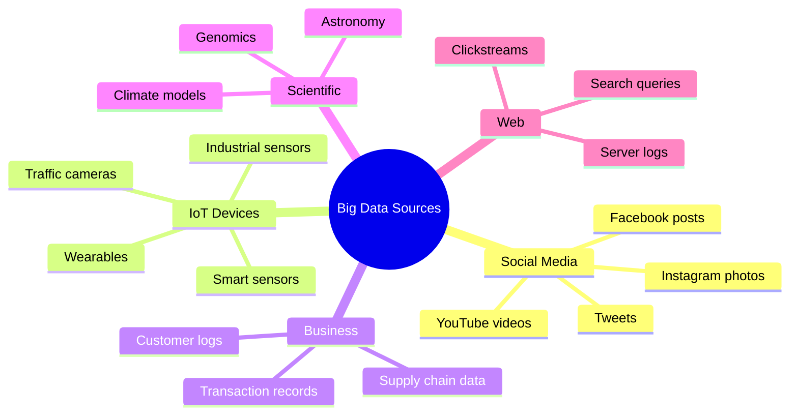

# 7.1 Introduction to Big Data

---

## Theory

!!! note "Definition"
    **Big Data** refers to extremely large, complex datasets that cannot be efficiently stored, processed, or analysed using traditional data management tools and techniques within a reasonable time frame.

### Scale of Big Data

| Scale | Size | Example |
|-------|------|---------|
| Kilobyte (KB) | 10³ bytes | A short email |
| Megabyte (MB) | 10⁶ bytes | A high-res photo |
| Gigabyte (GB) | 10⁹ bytes | A full-length HD movie |
| Terabyte (TB) | 10¹² bytes | All books in a large library |
| Petabyte (PB) | 10¹⁵ bytes | All US academic research libraries |
| Exabyte (EB) | 10¹⁸ bytes | All internet traffic in one day |
| Zettabyte (ZB) | 10²¹ bytes | Total digital data in the world |

> The world creates approximately **2.5 quintillion bytes (2.5 × 10¹⁸)** of data every day.

### Sources Generating Big Data



### Why Traditional Tools Fail

Traditional databases (MySQL, Oracle) were designed for:
- Structured data only
- Single-machine storage
- Moderate read/write volumes

Big Data requires:
- Handling structured, semi-structured, AND unstructured data
- **Distributed storage** across hundreds/thousands of machines
- **Parallel processing** of massive datasets
- Real-time or near-real-time processing

### Python Perspective — Working with Large Data

```python linenums="1" title="big_data_intro.py"
# Program : Introduction to Big Data Concepts
# Topic   : 7.1 Introduction to Big Data
# Author  : BT255CO Lecture Notes

import pandas as pd
import numpy as np
import time

# -------------------------------------------------------
# Simulating "large" data processing efficiently
# -------------------------------------------------------

print("Big Data Scale Demonstration")
print("=" * 50)

# Traditional approach — loading everything into memory
print("\n1. Pandas (in-memory) — 1 million rows:")
start = time.time()
df = pd.DataFrame({
    "user_id":    np.random.randint(1, 100000, 1_000_000),
    "product_id": np.random.randint(1, 5000, 1_000_000),
    "amount":     np.random.uniform(10, 500, 1_000_000),
    "timestamp":  pd.date_range("2024-01-01", periods=1_000_000, freq="s"),
})
elapsed = time.time() - start
print(f"   Size: {df.memory_usage(deep=True).sum() / 1e6:.1f} MB in RAM")
print(f"   Created in: {elapsed:.2f}s")
print(f"   Total revenue: ₹{df['amount'].sum():,.0f}")

# Chunked reading — Big Data technique
print("\n2. Chunked Processing (Big Data technique):")
df.to_csv("transactions.csv", index=False)

total_revenue = 0
chunk_count   = 0
start = time.time()

for chunk in pd.read_csv("transactions.csv", chunksize=100_000):
    total_revenue += chunk["amount"].sum()
    chunk_count   += 1

elapsed = time.time() - start
print(f"   Processed {chunk_count} chunks of 100,000 rows each")
print(f"   Total revenue (chunked): ₹{total_revenue:,.0f}")
print(f"   Time: {elapsed:.2f}s")
print("   ✔ Memory never exceeded one chunk (100,000 rows) at a time")

print("\n3. Data types summary:")
sizes = {
    "KB": 1e3, "MB": 1e6, "GB": 1e9,
    "TB": 1e12, "PB": 1e15, "EB": 1e18,
}
bytes_per_day = 2.5e18   # world daily data creation
print(f"   World creates {bytes_per_day/1e18:.1f} EB of data per day")
for unit, divisor in sizes.items():
    print(f"   = {bytes_per_day / divisor:,.0f} {unit}")
```

**Output:**
```
Big Data Scale Demonstration
==================================================

1. Pandas (in-memory) — 1 million rows:
   Size: 32.0 MB in RAM
   Created in: 0.84s
   Total revenue: ₹255,012,834

2. Chunked Processing (Big Data technique):
   Processed 10 chunks of 100,000 rows each
   Total revenue (chunked): ₹255,012,834
   Time: 2.31s
   ✔ Memory never exceeded one chunk (100,000 rows) at a time

3. Data types summary:
   World creates 2.5 EB of data per day
   = 2,500,000,000,000,000,000 B
   = 2,500,000,000,000,000 KB
   = 2,500,000,000,000 MB
   = 2,500,000,000 GB
   = 2,500,000 TB
   = 2,500 PB
   = 2.5 EB
```

---

## Summary

!!! success "Key Takeaways"
    - Big Data is defined not just by size but by the inability of traditional tools to handle it
    - The world generates ~2.5 EB of data every day
    - Sources include IoT sensors, social media, business transactions, and scientific instruments
    - **Chunked processing** is a key Big Data technique: process data in manageable pieces rather than loading everything into memory

---

## Review Questions

1. Define Big Data. What makes it different from regular data?
2. Name five sources generating Big Data today.
3. Why do traditional databases fail to handle Big Data?
4. What is chunked processing in Pandas? When would you use it?
5. List the data units from Kilobyte to Zettabyte with their sizes.

---

*Next:* [7.2 History of Big Data →](7_2.md)
