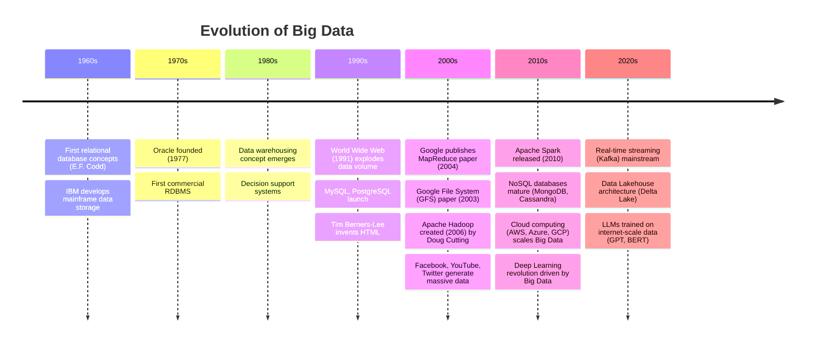
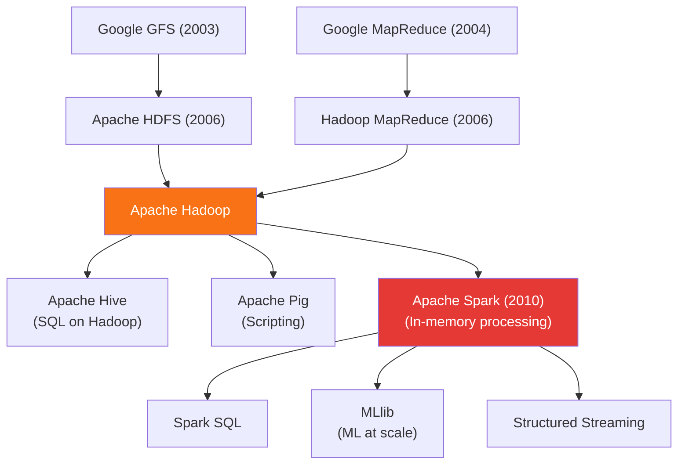

# 7.2 History of Big Data

---

## Theory

### Timeline of Big Data

---

### Key Milestones

| Year | Event | Significance |
|------|-------|-------------|
| **1970** | E.F. Codd proposes relational model | Foundation of structured databases |
| **1991** | World Wide Web launched | Exponential growth in unstructured data |
| **2003** | Google GFS paper published | Blueprint for distributed file systems |
| **2004** | Google MapReduce paper | Parallel processing paradigm |
| **2006** | Apache Hadoop released | First open-source Big Data framework |
| **2007** | iPhone launched | Mobile devices as massive data generators |
| **2009** | AWS S3/EC2 mainstream | Cloud-based Big Data storage |
| **2010** | Apache Spark created | In-memory processing (100× faster than Hadoop MR) |
| **2011** | IBM Watson wins Jeopardy | AI powered by Big Data |
| **2013** | NoSQL databases mainstream | MongoDB, Cassandra for unstructured data |
| **2015** | TensorFlow released | Deep Learning on Big Data |
| **2020** | GPT-3 released | Language model trained on 570 GB of text |

---

### The Google Papers — Foundation of Big Data

Three seminal papers from Google established the technical foundations:

1. **Google File System (GFS) — 2003**
   - Distributed file system across commodity hardware
   - Inspired **HDFS** (Hadoop Distributed File System)
   - Handles hardware failures automatically through replication

2. **MapReduce — 2004**
   - Programming model for parallel data processing
   - `Map`: transform each record independently
   - `Reduce`: aggregate the results
   - Inspired Apache Hadoop MapReduce

3. **BigTable — 2006**
   - Column-family NoSQL database
   - Inspired **Apache HBase, Cassandra**

---

### Hadoop Ecosystem Evolution

---

## Summary

!!! success "Key Takeaways"
    - Big Data history spans from 1970s relational databases to 2020s LLMs
    - **Google's three papers** (GFS, MapReduce, BigTable) established the technical foundations
    - **Apache Hadoop** (2006) was the first open-source Big Data platform
    - **Apache Spark** (2010) replaced Hadoop MapReduce with 100× faster in-memory processing
    - The **smartphone** and **cloud computing** were the biggest accelerators of data growth

---

## Review Questions

1. Who created Apache Hadoop and in which year?
2. What are Google's three foundational Big Data papers? What did each introduce?
3. What is the difference between Hadoop MapReduce and Apache Spark?
4. How did the launch of the World Wide Web in 1991 change the nature of data?
5. List three NoSQL databases that emerged from the Big Data era. What problem did they solve?

---

*Previous:* [← 7.1 Introduction](7_1.md) &nbsp;|&nbsp; *Next:* [7.3 The Six Vs →](7_3.md)
