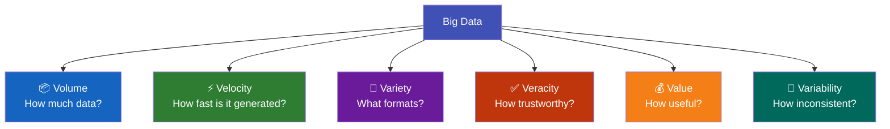

# 7.3 The Six Vs of Big Data

---

## Theory

The **"Vs" of Big Data** describe its defining characteristics. Originally coined as 3 Vs by Doug Laney (2001), the model has expanded to 6 Vs.

---

### V1 — Volume

!!! note "Definition"
    **Volume** refers to the sheer **size** of the data being generated and stored.

| Scale | Example |
|-------|---------|
| Facebook | ~4 PB of new data per day |
| Google | ~20 PB processed per day |
| Twitter | ~500 million tweets per day |
| YouTube | ~500 hours of video uploaded per minute |

- Requires **distributed storage** (HDFS, S3, Azure Blob)
- Vertical scaling (bigger server) is replaced by **horizontal scaling** (more servers)

---

### V2 — Velocity

!!! note "Definition"
    **Velocity** refers to the **speed** at which data is generated, collected, and processed.

| Type | Example | Processing |
|------|---------|-----------|
| **Batch** | End-of-day sales reports | Hadoop MapReduce |
| **Near-real-time** | Website clickstreams | Apache Kafka + Spark |
| **Real-time** | Stock tick data, fraud detection | Apache Kafka, Flink |
| **Streaming** | IoT sensor readings | Apache Storm, Spark Streaming |

---

### V3 — Variety

!!! note "Definition"
    **Variety** refers to the **different types and formats** of data.

| Type | Examples | Storage |
|------|---------|---------|
| **Structured** | SQL tables, CSV files | RDBMS, Data Warehouse |
| **Semi-structured** | JSON, XML, emails, logs | NoSQL, Data Lake |
| **Unstructured** | Images, videos, audio, social media text | Object Storage (S3) |

> ~80% of enterprise data is **unstructured**.

---

### V4 — Veracity

!!! note "Definition"
    **Veracity** refers to the **quality, accuracy, and trustworthiness** of the data.

Poor veracity means:
- Missing or incomplete records
- Inconsistent formats
- Noisy measurements (sensor errors)
- Biased or intentionally misleading data

Big Data veracity challenges are amplified because:
- Data comes from many heterogeneous sources
- No single organisation controls all data quality
- Errors propagate through the entire pipeline

---

### V5 — Value

!!! note "Definition"
    **Value** is the most important V — **the business or scientific insight** extracted from Big Data.

Raw Big Data has **no value** until it is processed and analysed. The value chain:

$$
\text{Raw Data} \rightarrow \text{Cleaning} \rightarrow \text{Processing} \rightarrow \text{Analysis} \rightarrow \text{Insight} \rightarrow \text{Decision} \rightarrow \text{Value}
$$

Example value:
- Amazon's recommendation engine generates **35% of total revenue** from Big Data
- Netflix saves **$1 billion/year** by personalising recommendations

---

### V6 — Variability

!!! note "Definition"
    **Variability** refers to the **inconsistency** in data — how meaning or format changes over context or time.

Examples:
- The word "bank" means different things in finance vs. geography contexts (NLP challenge)
- Sales data spikes unpredictably during festivals (seasonality)
- Sensor data format changes when firmware updates are deployed

---

### Summary Table

| V | Description | Challenge | Technology |
|---|-------------|-----------|-----------|
| **Volume** | Sheer size | Storage, processing | HDFS, S3, Parquet |
| **Velocity** | Speed of arrival | Real-time processing | Kafka, Spark Streaming |
| **Variety** | Multiple formats | Integration, parsing | NoSQL, Data Lake |
| **Veracity** | Data quality | Cleaning, validation | Data quality tools |
| **Value** | Business usefulness | Analysis, modelling | ML, Analytics |
| **Variability** | Changing meaning/format | Context awareness, normalisation | NLP, schema evolution |

---

## Review Questions

1. What are the original 3 Vs of Big Data? Who coined them?
2. Explain the difference between Velocity and Variability.
3. Why is "Value" considered the most important V?
4. What does "Veracity" mean in the context of Big Data? Give two examples.
5. Give an example of each of the 6 Vs from the healthcare industry.

---

*Previous:* [← 7.2 History](7_2.md) &nbsp;|&nbsp; *Next:* [7.4 Characteristics →](7_4.md)
