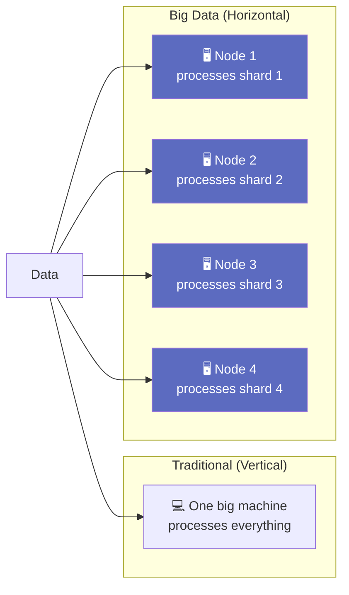

# 7.4 Characteristics of Big Data

---

## Theory

Beyond the 6 Vs, Big Data has several important **operational and technical characteristics** that distinguish it from conventional data systems.

---

### Core Characteristics

| Characteristic | Description |
|---------------|-------------|
| **Distributed** | Stored and processed across multiple machines in a cluster |
| **Fault Tolerant** | System continues operating despite hardware failures; data is replicated |
| **Scalable** | Capacity grows by adding more nodes (horizontal scaling) |
| **Heterogeneous** | Comes from diverse sources in different formats and schemas |
| **High Dimensionality** | Thousands of features/attributes per record |
| **Temporal** | Has a time dimension; data has timestamps and may be ordered |
| **Geospatial** | Often includes location data (GPS, city, region) |
| **Dynamic** | Data is continuously being added and updated |

---

### Distributed Computing Principle

In traditional computing, one powerful machine processes everything (**vertical scaling**).

In Big Data, work is **distributed** across many commodity machines (**horizontal scaling**):

**Fault Tolerance:** If Node 2 fails, the data it held has copies on other nodes (HDFS replication factor = 3 by default).

---

### HDFS Architecture

Hadoop Distributed File System (HDFS) stores Big Data across a cluster:

| Component | Role |
|-----------|------|
| **NameNode** | Master — tracks file locations and metadata (the directory service) |
| **DataNode** | Worker — stores actual data blocks |
| **Block** | Files are split into fixed-size blocks (default 128 MB) |
| **Replication** | Each block copied to 3 DataNodes for fault tolerance |

---

### CAP Theorem

For distributed data systems, it is **impossible to simultaneously guarantee** all three:

- **C**onsistency — all nodes see the same data at the same time
- **A**vailability — every request receives a response
- **P**artition Tolerance — system continues operating despite network failures

> In practice: choose two. Most Big Data systems choose **AP** (availability + partition tolerance), accepting eventual consistency.

---

## Summary

!!! success "Key Takeaways"
    - Big Data systems are **distributed, fault-tolerant, and horizontally scalable**
    - HDFS stores data as 128 MB blocks replicated across DataNodes
    - The **CAP theorem** states distributed systems must trade off consistency, availability, or partition tolerance
    - Big Data is typically **heterogeneous** (structured + unstructured) and **dynamic** (continuously updated)

---

## Review Questions

1. What is the difference between vertical scaling and horizontal scaling?
2. Explain the role of NameNode and DataNode in HDFS.
3. State the CAP Theorem. Which two properties do most Big Data systems choose?
4. What is the default block size and replication factor in HDFS? Why?
5. Why is fault tolerance critical in Big Data infrastructure?

---

*Previous:* [← 7.3 Six Vs](7_3.md) &nbsp;|&nbsp; *Next:* [7.5 Challenges and Future →](7_5.md)
