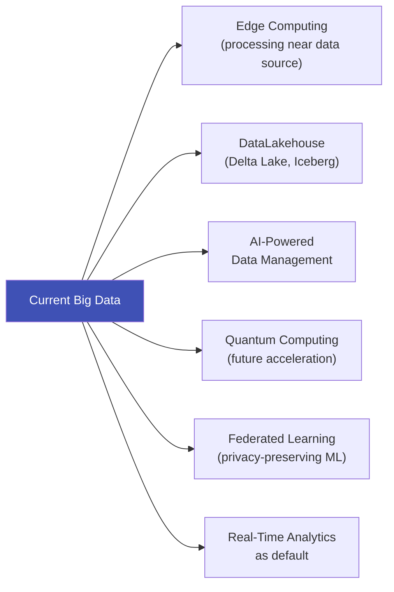

# 7.5 Challenges and Future of Big Data

---

## Theory

### Technical Challenges

| Challenge | Description | Solution |
|-----------|-------------|---------|
| **Storage** | Petabytes require massive infrastructure | Cloud object storage (S3, Azure Blob) |
| **Processing Speed** | Real-time analytics on high-velocity data | Spark Streaming, Apache Flink, Kafka |
| **Data Integration** | Combining data from heterogeneous sources | ETL pipelines, Data Lake architectures |
| **Data Quality** | Noisy, incomplete, inconsistent data | Data validation, automated cleaning |
| **Security** | Protecting sensitive data at scale | Encryption, access controls, GDPR |
| **Scalability** | Dynamically scaling with data growth | Auto-scaling in cloud clusters |
| **Latency** | Achieving sub-second query responses | In-memory databases, caching (Redis) |
| **Skill Gap** | Shortage of Big Data engineers | Education, certifications, no-code tools |

---

### Organisational Challenges

- **Data Silos** — Different departments store data in incompatible systems
- **Governance** — Who owns the data? Who can access it?
- **Cost** — Storage + compute costs can be enormous
- **ROI Uncertainty** — Not all Big Data projects deliver measurable value

---

### Privacy and Ethical Challenges

- **Re-identification** — Anonymised datasets can be de-anonymised by combining data sources
- **Surveillance** — Governments and corporations use Big Data to track individuals
- **Consent** — Users often don't understand what data is collected about them
- **Algorithmic Discrimination** — Biased training data leads to unfair automated decisions

---

### Future Trends in Big Data

| Trend | Description |
|-------|-------------|
| **Edge Computing** | Processing data near the source (e.g., in IoT devices) rather than sending all raw data to the cloud |
| **Data Lakehouse** | Combines Data Lake flexibility with Data Warehouse structure (Delta Lake, Apache Iceberg) |
| **Streaming-First** | Real-time stream processing becomes the default, not batch processing |
| **AutoML on Big Data** | Automated machine learning pipelines that scale to petabyte datasets |
| **Federated Learning** | Train ML models on distributed data without centralising it — preserves privacy |

---

## Summary

!!! success "Key Takeaways"
    - Technical challenges include storage, processing speed, integration, and latency
    - Privacy and ethics are increasingly critical: GDPR, data consent, algorithmic bias
    - **Edge computing** moves processing to the data source
    - **DataLakehouse** merges the best of Data Lakes and Data Warehouses
    - The future is **real-time, privacy-preserving, and AI-driven**

---

## Review Questions

1. List five technical challenges in Big Data with solutions.
2. What is a data silo? Why is it a problem in organisations?
3. What is re-identification? Give an example.
4. Explain federated learning. Why does it address Big Data privacy challenges?
5. What is Edge Computing? Why is it increasingly important?

---

*Previous:* [← 7.4 Characteristics](7_4.md) &nbsp;|&nbsp; *Next:* [7.6 Practices and Use Cases →](7_6.md)
