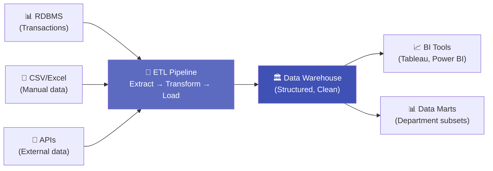
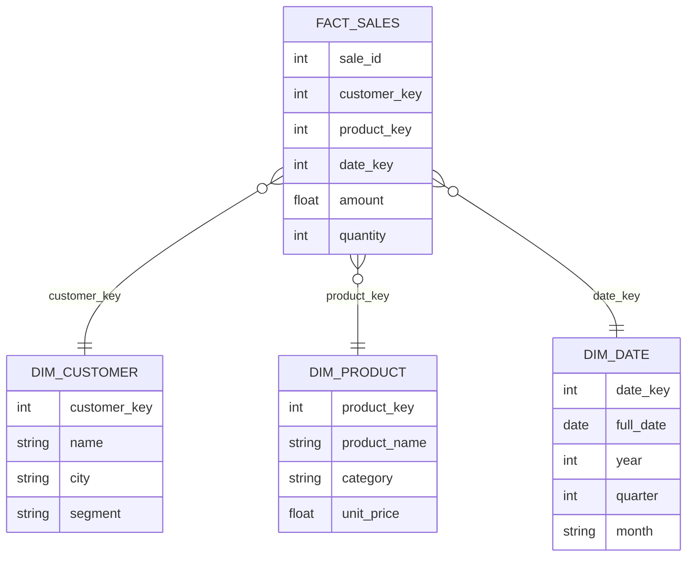

# 7.7 Data Warehouse and Data Lakes

---

## Theory

### Data Warehouse

!!! note "Definition"
    A **Data Warehouse** is a centralised repository that stores **structured, integrated, historical data** from multiple sources, optimised for **analytical queries and reporting** rather than transactional operations.

**Key characteristics:**
- **Subject-oriented** — organised around business subjects (sales, customers, products)
- **Integrated** — data from all sources is cleaned and standardised
- **Non-volatile** — once loaded, data is not modified or deleted
- **Time-variant** — stores historical data for trend analysis

**Architecture — ETL (Extract, Transform, Load):**

**Examples:** Amazon Redshift, Google BigQuery, Snowflake, Microsoft Azure Synapse

---

### Data Lake

!!! note "Definition"
    A **Data Lake** is a centralised repository that stores **all types of data** (structured, semi-structured, and unstructured) **in their raw, native format** at any scale, until it is needed.

**Key characteristics:**
- **Schema-on-read** — structure is applied when reading, not when writing
- **Stores everything** — raw logs, JSON, images, text, CSVs
- **Cheap storage** — uses object storage (S3, Azure Blob, HDFS)
- **ELT instead of ETL** — Extract, Load (raw), then Transform when querying

**Examples:** Amazon S3, Azure Data Lake Storage, Hadoop HDFS, Google Cloud Storage

---

### Data Warehouse vs. Data Lake

| Feature | Data Warehouse | Data Lake |
|---------|---------------|-----------|
| **Data Type** | Structured only | Any (structured + unstructured) |
| **Schema** | Schema-on-write (defined before loading) | Schema-on-read (defined when querying) |
| **Processing** | ETL | ELT |
| **Purpose** | BI, dashboards, standard reports | Exploration, ML, data science |
| **Users** | Business analysts | Data scientists, engineers |
| **Query Speed** | Very fast for predefined queries | Slower (but flexible) |
| **Cost** | High (proprietary systems) | Low (commodity storage) |
| **Agility** | Low (rigid schema) | High (flexible) |
| **Data Quality** | High (cleaned before load) | Variable (raw data) |

!!! tip "Which to choose?"
    - Need fast, reliable reports for business users? → **Data Warehouse**
    - Need to store raw data for future exploration? → **Data Lake**
    - Need both? → **DataLakehouse** (Delta Lake, Apache Iceberg)

---

### DataLakehouse — The Best of Both

A **DataLakehouse** combines the flexibility of a Data Lake with the ACID transactions and performance of a Data Warehouse.

| Feature | DataLakehouse |
|---------|--------------|
| Technology | Delta Lake, Apache Iceberg, Apache Hudi |
| Storage | Low-cost object storage |
| ACID | ✅ Supported |
| Schema enforcement | ✅ Supported |
| ML/DS workloads | ✅ Supported |
| BI workloads | ✅ Supported |

---

### Star Schema (Data Warehouse Design)

Data Warehouses are often designed using a **Star Schema**:

- **Fact Table** — stores measurable events (sales, transactions)
- **Dimension Tables** — store descriptive context (who, what, when, where)

---

## Summary

!!! success "Key Takeaways"
    - **Data Warehouse** = clean, structured, historical data; schema-on-write; fast BI queries
    - **Data Lake** = raw, any-format storage; schema-on-read; flexible for data science
    - **DataLakehouse** = combines both (Delta Lake, Iceberg) — the modern standard
    - Data Warehouses use **star schema** (fact tables + dimension tables)
    - ETL feeds data warehouses; ELT feeds data lakes

---

## Review Questions

1. What is a Data Warehouse? List its four key characteristics.
2. What is the difference between ETL and ELT?
3. Compare a Data Warehouse and a Data Lake on five dimensions.
4. What is a DataLakehouse? Name two technologies that implement it.
5. Draw and explain the Star Schema for a retail sales database.

---

*Previous:* [← 7.6 Practices](7_6.md) &nbsp;|&nbsp; *Next:* [7.8 Big Data Analytics →](7_8.md)
