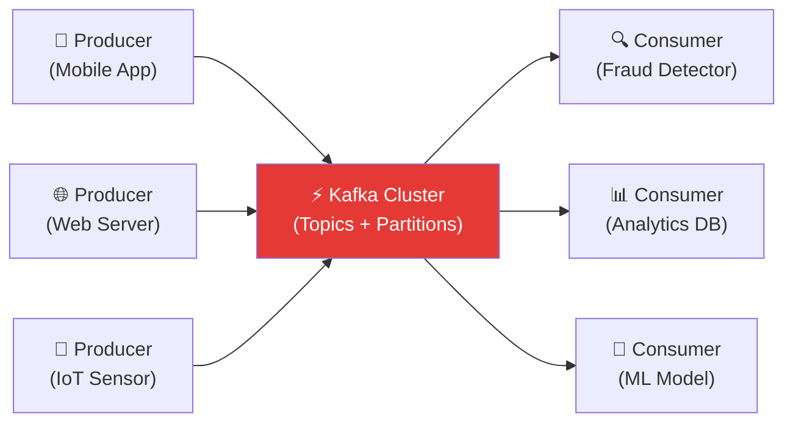
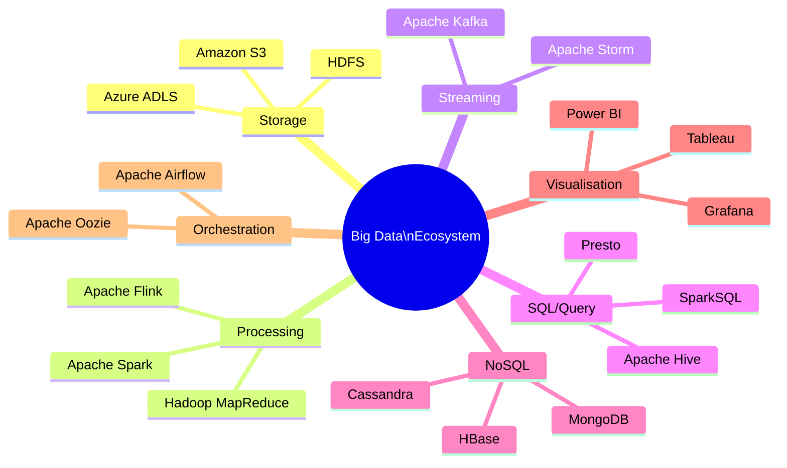

# 7.8 Big Data Analytics

---

## Theory

### Types of Big Data Analytics

| Type | Question Answered | Example |
|------|-------------------|---------|
| **Descriptive** | What happened? | Monthly sales report |
| **Diagnostic** | Why did it happen? | Root-cause analysis of sales drop |
| **Predictive** | What will happen? | Demand forecasting |
| **Prescriptive** | What should we do? | Optimal pricing recommendation |
| **Real-time/Streaming** | What is happening NOW? | Fraud detection during transaction |

---

### Apache Hadoop

**Hadoop** is an open-source framework for distributed storage and processing of big data.

| Component | Role |
|-----------|------|
| **HDFS** | Distributed storage across a cluster |
| **MapReduce** | Batch processing engine |
| **YARN** | Resource manager for the cluster |
| **Hive** | SQL-like queries on Hadoop data |
| **Pig** | Scripting language for data transformation |
| **HBase** | NoSQL columnar database on HDFS |

---

### Apache Spark

**Spark** is the modern successor to Hadoop MapReduce — up to **100× faster** because it processes data **in-memory** rather than writing to disk between stages.

| Component | Purpose |
|-----------|---------|
| **Spark Core** | Distributed task scheduling |
| **Spark SQL** | SQL queries + DataFrames |
| **Spark Streaming** | Real-time data stream processing |
| **MLlib** | Scalable machine learning library |
| **GraphX** | Graph processing |

---

### PySpark — Python API for Apache Spark

```python linenums="1" title="pyspark_wordcount.py"
# Program : PySpark Word Count (Classic Big Data example)
# Topic   : 7.8 Big Data Analytics
# NOTE    : Requires PySpark installed: pip install pyspark
# Author  : BT255CO Lecture Notes

from pyspark.sql import SparkSession
from pyspark.sql.functions import explode, split, lower, col, regexp_replace

# -------------------------------------------------------
# 1. Create SparkSession (entry point to Spark)
# -------------------------------------------------------
spark = SparkSession.builder \
    .appName("BT255CO-WordCount") \
    .master("local[*]") \
    .getOrCreate()

spark.sparkContext.setLogLevel("ERROR")

# -------------------------------------------------------
# 2. Sample text data (in real use: spark.read.text("hdfs://..."))
# -------------------------------------------------------
texts = [
    ("Data Science is an interdisciplinary field",),
    ("Machine Learning is a subset of Artificial Intelligence",),
    ("Data is the new oil in Data Science",),
    ("Python is the most popular language for Data Science",),
]
df = spark.createDataFrame(texts, ["line"])

# -------------------------------------------------------
# 3. Word count pipeline
# -------------------------------------------------------
word_counts = (
    df
    .select(explode(split(lower(col("line")), r"\s+")).alias("word"))
    .filter(col("word") != "")
    .withColumn("word", regexp_replace(col("word"), r"[^a-z]", ""))
    .groupBy("word")
    .count()
    .orderBy("count", ascending=False)
)

print("Top 15 Word Frequencies:")
word_counts.show(15, truncate=False)

# -------------------------------------------------------
# 4. SQL query on Spark DataFrame
# -------------------------------------------------------
df.createOrReplaceTempView("texts")
result = spark.sql("""
    SELECT word, COUNT(*) as freq
    FROM (
        SELECT explode(split(lower(line), ' ')) as word
        FROM texts
    )
    WHERE word != ''
    GROUP BY word
    ORDER BY freq DESC
    LIMIT 5
""")
print("Top 5 words (via Spark SQL):")
result.show()

spark.stop()
```

**Expected Output:**
```
Top 15 Word Frequencies:
+-------------+-----+
|word         |count|
+-------------+-----+
|data         |    4|
|science      |    3|
|is           |    4|
|a            |    1|
|of           |    1|
...
```

---

### Apache Kafka — Real-Time Data Streaming

**Kafka** is a distributed event streaming platform used for high-throughput, real-time data pipelines.



| Concept | Description |
|---------|-------------|
| **Producer** | Publishes messages to Kafka topics |
| **Consumer** | Subscribes to topics and processes messages |
| **Topic** | Named stream of records (like a database table) |
| **Partition** | Topic is divided into partitions for parallel processing |
| **Broker** | A Kafka server managing topics and partitions |
| **Offset** | Position of a message within a partition |

---

### Big Data Tools Ecosystem



---

## Summary

!!! success "Key Takeaways"
    - The four analytics types are: **Descriptive, Diagnostic, Predictive, Prescriptive**
    - **Apache Hadoop** provides HDFS + MapReduce for distributed batch processing
    - **Apache Spark** is 100× faster than MapReduce by processing in-memory
    - **PySpark** is the Python API for Spark; supports SQL, ML (MLlib), and streaming
    - **Apache Kafka** enables real-time event streaming between producers and consumers

---

## Review Questions

1. What are the four types of Big Data analytics? Give an example of each.
2. How is Apache Spark different from Hadoop MapReduce? What makes it faster?
3. Explain Kafka's producer-consumer model with a real-time fraud detection example.
4. What is MLlib in Spark? How is it different from scikit-learn?
5. What is Apache Airflow and why is it needed in Big Data pipelines?

---

*Previous:* [← 7.7 Data Warehouse and Data Lakes](7_7.md) &nbsp;|&nbsp; *Next:* [Unit 8 → Data Science Ethics](../Unit8/index.md)
