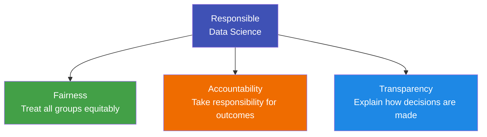

# 8.1 Data Science Ethics

---

## Theory

!!! note "Definition"
    **Data Science Ethics** is the set of values, principles, and guidelines that govern the responsible collection, analysis, use, and sharing of data, ensuring it is used fairly, transparently, and without causing harm.

### Why Data Ethics Matters

Data Science systems now make decisions that directly affect people's lives:

| Application | Ethical Risk |
|-------------|-------------|
| **Hiring algorithms** | Discriminate against protected groups |
| **Credit scoring** | Deny loans to marginalised communities unfairly |
| **Predictive policing** | Reinforce racial bias in law enforcement |
| **Medical diagnosis AI** | Underperform on underrepresented patient groups |
| **Social media algorithms** | Amplify misinformation and extremism |
| **Surveillance systems** | Violate privacy at scale |

---

### Real-World Ethical Failures

!!! danger "Amazon's Recruiting AI (2018)"
    Amazon trained a recruitment AI on 10 years of resumes. Since historical hires were mostly male, the model learned to **penalise resumes that included the word "women's"** (e.g., "women's chess club"). The project was scrapped.

!!! danger "COMPAS Recidivism Algorithm"
    A US judicial system used an algorithm to predict likelihood of re-offending. A ProPublica investigation found it was **twice as likely to falsely flag Black defendants** as high-risk compared to white defendants.

!!! danger "Facebook and Cambridge Analytica (2018)"
    Data of 87 million Facebook users was harvested without consent and used to target voters in the 2016 US election — a landmark data privacy breach.

---

### The Three Pillars of Responsible Data Science

---

### Ethical Questions Every Data Scientist Should Ask

- **Collection:** Was this data collected with informed consent?
- **Representation:** Does the training data represent all affected groups fairly?
- **Bias:** What biases might exist in the data or model?
- **Impact:** Who could be harmed by this model's decisions?
- **Transparency:** Can we explain why the model made a specific decision?
- **Purpose:** Is this analysis being used for its stated purpose?
- **Minimisation:** Are we collecting only the data we actually need?

---

## Summary

!!! success "Key Takeaways"
    - Data Science Ethics ensures responsible use of data and AI systems
    - Real-world failures (Amazon, COMPAS, Cambridge Analytica) show the consequences of ignoring ethics
    - Three pillars: **Fairness, Accountability, Transparency**
    - Every data scientist must ask ethical questions at every stage of the lifecycle

---

## Review Questions

1. Define Data Science Ethics. Why has it become more important in recent years?
2. Explain the three pillars of responsible data science.
3. Describe the Amazon recruiting AI failure. What went wrong?
4. What is the COMPAS algorithm? What ethical issue was identified?
5. List five ethical questions a data scientist should ask before building a model.

---

*Next:* [8.2 Principles of Data Ethics →](8_2.md)
