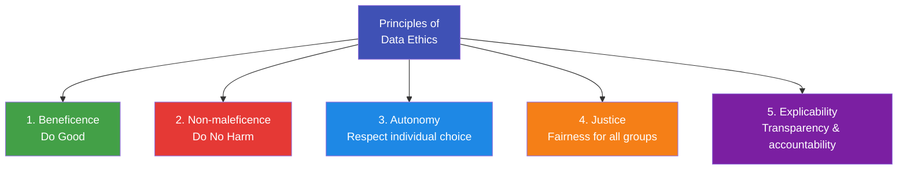

# 8.2 Principles of Data Ethics

---

## Theory

Several frameworks define the core principles of ethical data practice. The most widely adopted is the **FAIR + Ethical** framework:

---

### The Five Core Principles



| Principle | Description | Data Science Application |
|-----------|-------------|-------------------------|
| **Beneficence** | Data should be used to benefit individuals and society | Use ML to improve medical diagnosis |
| **Non-maleficence** | Avoid harm, discrimination, and violation of privacy | Don't deploy a biased hiring model |
| **Autonomy** | Respect people's right to control their own data | Obtain informed consent; provide opt-out |
| **Justice** | Fair distribution of benefits and burdens | Audit models for disparate impact on minorities |
| **Explicability** | Decisions must be understandable and accountable | Use interpretable models; document decisions |

---

### Fairness in Machine Learning

Algorithmic fairness has multiple, sometimes conflicting, definitions:

| Fairness Metric | Definition |
|----------------|-----------|
| **Demographic Parity** | Equal approval rates across all groups |
| **Equal Opportunity** | Equal true positive rates across groups |
| **Predictive Parity** | Equal precision (PPV) across groups |
| **Individual Fairness** | Similar individuals receive similar outcomes |

!!! warning "Fairness is not one thing"
    It is **mathematically impossible** to satisfy all fairness metrics simultaneously (Chouldechova, 2017). Data scientists must choose which fairness definition is most appropriate for the context.

---

### Transparency and Explainability

!!! note "Definition"
    **Explainability** (or Interpretability) is the ability to explain in understandable terms why a machine learning model made a specific decision.

| Technique | Description | Use Case |
|-----------|-------------|---------|
| **LIME** | Local Interpretable Model-agnostic Explanations | Explain individual predictions |
| **SHAP** | SHapley Additive exPlanations | Feature attribution |
| **Decision Trees** | Inherently interpretable | Replace black-box where possible |
| **Saliency Maps** | Highlight image regions driving CNN decisions | Medical imaging |

```python linenums="1" title="shap_demo.py"
# Program : Feature Attribution using SHAP values
# Topic   : 8.2 Principles of Data Ethics
# Requires: pip install shap
# Author  : BT255CO Lecture Notes

import numpy as np
from sklearn.ensemble import RandomForestClassifier
from sklearn.datasets import load_breast_cancer
from sklearn.model_selection import train_test_split

try:
    import shap

    data = load_breast_cancer()
    X, y = data.data, data.target

    X_train, X_test, y_train, y_test = train_test_split(
        X, y, test_size=0.2, random_state=42
    )

    model = RandomForestClassifier(n_estimators=100, random_state=42)
    model.fit(X_train, y_train)

    # Compute SHAP values
    explainer   = shap.TreeExplainer(model)
    shap_values = explainer.shap_values(X_test[:10])   # first 10 test samples

    # Mean absolute SHAP values = overall feature importance
    mean_shap = np.abs(shap_values[1]).mean(axis=0)
    feature_importance = sorted(
        zip(data.feature_names, mean_shap),
        key=lambda x: -x[1]
    )

    print("Top 10 features by SHAP value (ethical transparency):")
    for feat, val in feature_importance[:10]:
        bar = "█" * int(val * 20)
        print(f"  {feat:<30} {val:.4f} {bar}")

except ImportError:
    print("SHAP not installed. Run: pip install shap")
    print("SHAP provides feature attribution for any ML model,")
    print("enabling transparency by showing which features drove each decision.")
```

---

### Data Minimisation Principle

!!! tip "GDPR Principle: Collect only what you need"
    Data minimisation states that organisations should collect **only the personal data that is strictly necessary** for the stated purpose.

**In practice:**
- Don't collect age, race, or gender unless they are directly relevant to the task
- Delete data when it is no longer needed
- Use anonymisation/pseudonymisation where possible

---

## Summary

!!! success "Key Takeaways"
    - The five ethical principles are: Beneficence, Non-maleficence, Autonomy, Justice, Explicability
    - Fairness in ML has multiple definitions; they can mathematically conflict
    - **SHAP** and **LIME** provide post-hoc explanations for complex models
    - **Data minimisation** — only collect what you need
    - Ethics must be built into the design of ML systems, not added as an afterthought

---

## Review Questions

1. Explain each of the five principles of data ethics with a data science example.
2. What is demographic parity? How does it differ from equal opportunity?
3. Why is it impossible to satisfy all fairness metrics simultaneously?
4. What is SHAP? How does it promote transparency in ML?
5. What is the data minimisation principle? Give two examples of its application.

---

*Previous:* [← 8.1 Data Science Ethics](8_1.md) &nbsp;|&nbsp; *Next:* [8.3 Privacy Concerns →](8_3.md)
