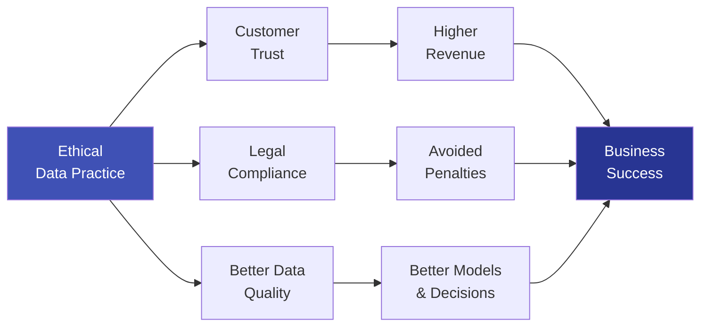

# 8.4 Benefits of Data Ethics

---

## Theory

Ethics in Data Science is often perceived as a constraint, but it is increasingly recognised as a **strategic advantage** — for organisations, individuals, and society.

---

### Benefits for Organisations

| Benefit | Description |
|---------|-------------|
| **Trust** | Ethical practices build user trust — the foundation of digital business |
| **Legal compliance** | Avoids massive fines (GDPR: up to 4% of global revenue) |
| **Reputation protection** | Ethical failures cause irreversible brand damage |
| **Better models** | Debiased, high-quality data leads to more accurate and reliable models |
| **Employee retention** | Ethically-minded engineers prefer responsible employers |
| **Investor confidence** | ESG (Environmental, Social, Governance) metrics include data ethics |

---

### Benefits for Individuals

| Benefit | Description |
|---------|-------------|
| **Privacy protection** | Personal data is not misused |
| **Fairer decisions** | Automated decisions are not discriminatory |
| **Transparency** | Individuals understand how decisions affecting them are made |
| **Control** | Right to access, correct, and delete personal data |
| **Safety** | Protection from identity theft, fraud, and manipulation |

---

### Benefits for Society

| Benefit | Description |
|---------|-------------|
| **Social justice** | AI systems do not perpetuate historical discrimination |
| **Scientific integrity** | Research findings are reproducible and honest |
| **Democracy** | Prevents misuse of data to manipulate elections or public opinion |
| **Innovation with trust** | Society is more willing to adopt technology when it is safe and fair |

---

### The Business Case for Ethics

**Example:** Apple's "Privacy as a Feature" strategy made privacy a key selling point, differentiating it from Google and Facebook. This is directly linked to its premium brand value.

---

## Summary

!!! success "Key Takeaways"
    - Ethical data practices generate trust, ensure legal compliance, protect reputation, and improve model quality
    - For individuals: privacy, fairness, transparency, and control
    - For society: reduced discrimination, democratic integrity, and trust in AI
    - **Ethics is not just right — it is profitable**: organisations with strong data ethics outperform those without

---

## Review Questions

1. How does data ethics benefit an organisation from a legal perspective?
2. How does ethical data practice lead to better ML models?
3. Explain Apple's "privacy as a feature" strategy. What business benefit does it deliver?
4. What are ESG metrics? How is data ethics part of ESG?
5. How does data ethics protect democracy?

---

*Previous:* [← 8.3 Privacy Concerns](8_3.md) &nbsp;|&nbsp; *Next:* [8.5 Laws Related to Data Protection →](8_5.md)
