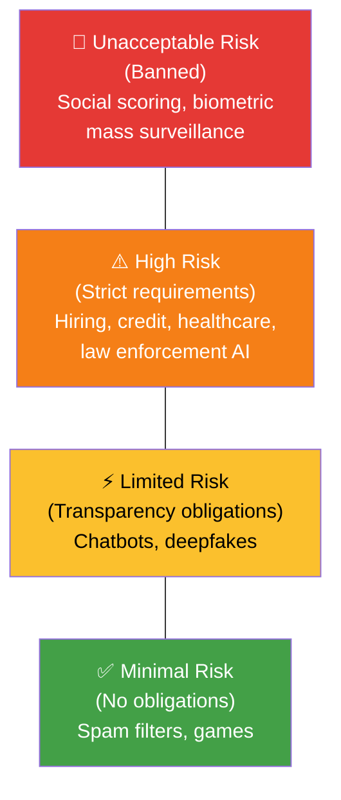

# 8.5 Laws Related to the Protection of Data, Algorithms, and AI

---

## Theory

### Global Legal Landscape

Laws governing data, algorithms, and AI are rapidly evolving. Here is the current landscape:

---

### Data Protection Laws

| Law | Country/Region | Year | Key Focus |
|-----|---------------|------|-----------|
| **GDPR** | European Union | 2018 | Comprehensive personal data protection |
| **CCPA/CPRA** | California, USA | 2020/2023 | Consumer data rights, opt-out of sale |
| **LGPD** | Brazil | 2020 | GDPR-equivalent for Brazil |
| **PIPL** | China | 2021 | Personal information protection |
| **DPDP Act** | India | 2023 | Personal data protection and rights |
| **PDPA** | Singapore | 2012 | Personal data governance |
| **IT Act + Amendments** | India | 2000/2011 | Cybercrime and sensitive personal data |

---

### India's Data Protection Framework

**Information Technology Act, 2000 (IT Act):**
- Section 43A: Compensation for negligent handling of sensitive personal data
- Section 72A: Punishment for disclosure of information without consent

**DPDP Act, 2023 (Digital Personal Data Protection Act):**
- Applies to processing of digital personal data within India
- **Data Principal** = individual whose data is collected
- **Data Fiduciary** = entity that determines purpose of processing
- **Data Processor** = entity that processes on behalf of fiduciary
- Key rights: access, correction, erasure, grievance redressal
- Penalties: up to ₹250 crore per breach

---

### AI Regulation — Emerging Laws

| Regulation | Region | Status | Key Provisions |
|-----------|--------|--------|---------------|
| **EU AI Act** | European Union | 2024 | World's first comprehensive AI law; risk-based classification |
| **Executive Order on AI** | USA | 2023 | Safety, security, and trustworthiness of AI |
| **AI Governance Framework** | Singapore | 2019 | Voluntary principles for responsible AI |

**EU AI Act — Risk Classification:**

---

### Intellectual Property in Data Science

| Aspect | Protection |
|--------|-----------|
| **Training data** | Copyright may apply to original works in the dataset |
| **ML models** | May be protected as trade secrets or patented |
| **AI-generated content** | Legally complex; varies by jurisdiction; generally not copyrightable |
| **Databases** | Database rights (EU) or copyright in selection and arrangement |

---

## Summary

!!! success "Key Takeaways"
    - GDPR (EU) is the most comprehensive global data protection law
    - India's **DPDP Act 2023** is the national data protection framework
    - The **EU AI Act** is the world's first comprehensive AI regulation — classifies AI by risk
    - High-risk AI (hiring, credit, healthcare) faces strict transparency and audit requirements
    - Banned AI includes social scoring systems and real-time biometric mass surveillance

---

## Review Questions

1. List five data protection laws from different countries with their years.
2. What are the three tiers in India's DPDP Act data processing relationships?
3. How does the EU AI Act classify AI systems? Give one example from each risk tier.
4. What does Section 43A of the IT Act protect against?
5. Who owns the copyright to content generated by an AI model?

---

*Previous:* [← 8.4 Benefits](8_4.md) &nbsp;|&nbsp; *Next:* [8.6 Considerations for Ethics →](8_6.md)
