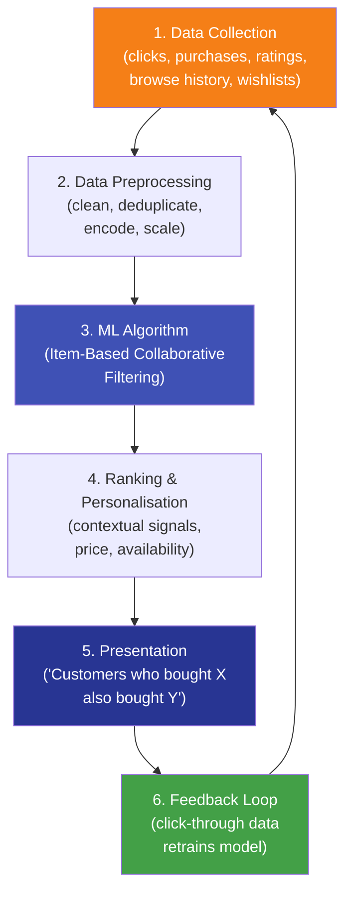

# 9.1 Real-Life Data Science — Amazon's Recommendation System

---

## Introduction

Amazon is the world's largest e-commerce platform with over **300 million active customers** and **350 million+ products**. At the heart of its business is one of the most sophisticated Data Science systems ever built: its **recommendation engine**.

> **"35% of Amazon's revenue is generated by its recommendation engine."** — McKinsey, 2013

This case study traces how Amazon applies Data Science end-to-end — and how every concept from this course connects to a real system.

---

## How Amazon's Recommendation System Works



---

## The Algorithm — Item-Based Collaborative Filtering

**Collaborative Filtering** finds patterns in user behaviour to recommend items. Amazon uses **item-based CF** because:
- More scalable than user-based CF (millions of items vs. hundreds of millions of users)
- More stable — item relationships change less frequently than user preferences

**How it works:**

1. Build an item-item similarity matrix from purchase/rating data
2. For a given item $i$, find the $k$ most similar items
3. Recommend those similar items to users who interacted with $i$

**Similarity measure — Cosine Similarity:**

$$
\text{similarity}(i, j) = \frac{\mathbf{r}_i \cdot \mathbf{r}_j}{|\mathbf{r}_i| \cdot |\mathbf{r}_j|}
$$

where $\mathbf{r}_i$ is the ratings vector for item $i$ across all users.

---

## Python Implementation — Simplified Amazon Recommender

```python linenums="1" title="amazon_recommender.py"
# Program : Simplified Amazon-style Recommendation System
# Topic   : 9.1 Real-Life Data Science — Amazon
# Author  : BT255CO Lecture Notes

import numpy as np
import pandas as pd
from sklearn.metrics.pairwise import cosine_similarity

# -------------------------------------------------------
# 1. DATA COLLECTION (simulated)
# -------------------------------------------------------
# User-item rating matrix: rows = users, cols = products
# 0 = not purchased/rated; 1–5 = rating

products = [
    "Python Book", "ML Book", "Data Science Book",
    "NumPy Guide", "Deep Learning Book",
    "Statistics Textbook", "SQL Handbook", "Pandas Guide"
]

ratings_data = np.array([
    #  Py  ML  DS  Np  DL  St  SQ  Pd
    [5,  4,  5,  3,  0,  2,  0,  4],   # User 1 (Priya)
    [4,  5,  4,  4,  4,  3,  0,  3],   # User 2 (Raj)
    [0,  0,  3,  0,  5,  0,  0,  0],   # User 3 (Sam)
    [5,  3,  5,  5,  0,  4,  3,  5],   # User 4 (Aisha)
    [3,  4,  3,  0,  3,  5,  2,  0],   # User 5 (Vikram)
    [0,  5,  0,  4,  5,  0,  0,  3],   # User 6 (Zara)
    [5,  0,  4,  4,  0,  3,  5,  4],   # User 7 (Kumar)
], dtype=float)

users = ["Priya", "Raj", "Sam", "Aisha", "Vikram", "Zara", "Kumar"]

df = pd.DataFrame(ratings_data, index=users, columns=products)
print("User-Item Rating Matrix:")
print(df)
print()

# -------------------------------------------------------
# 2. DATA PREPROCESSING
# -------------------------------------------------------
# Normalise: subtract each user's mean to account for bias
df_norm = df.copy()
for user in users:
    rated     = df.loc[user, df.loc[user] > 0]
    user_mean = rated.mean()
    df_norm.loc[user, df.loc[user] > 0] -= user_mean

# -------------------------------------------------------
# 3. ITEM-BASED COLLABORATIVE FILTERING
# -------------------------------------------------------
# Compute item-item cosine similarity (transpose: items as rows)
item_matrix = df_norm.T.values
item_sim    = cosine_similarity(item_matrix)
item_sim_df = pd.DataFrame(item_sim, index=products, columns=products)

print("Item-Item Cosine Similarity Matrix (top 4 per item):")
for item in products:
    similar = item_sim_df[item].sort_values(ascending=False)[1:4]
    print(f"\n  '{item}' is most similar to:")
    for sim_item, score in similar.items():
        print(f"    → {sim_item:<25} (similarity: {score:.3f})")

# -------------------------------------------------------
# 4. RECOMMENDATION FUNCTION
# -------------------------------------------------------
def recommend(user_name, n=3):
    """
    Recommend n products for a user using item-based CF.
    """
    user_ratings   = df.loc[user_name]
    purchased      = user_ratings[user_ratings > 0].index.tolist()
    not_purchased  = user_ratings[user_ratings == 0].index.tolist()

    scores = {}
    for item in not_purchased:
        # Weighted sum of similarities to items user has rated
        sim_scores = item_sim_df[item][purchased]
        ratings    = user_ratings[purchased]
        if sim_scores.sum() > 0:
            scores[item] = (sim_scores * ratings).sum() / sim_scores.sum()

    recommendations = sorted(scores.items(), key=lambda x: -x[1])[:n]
    return recommendations

# -------------------------------------------------------
# 5. GENERATE RECOMMENDATIONS
# -------------------------------------------------------
print("\n" + "=" * 55)
print("PERSONALISED RECOMMENDATIONS")
print("=" * 55)
for user in users:
    recs = recommend(user)
    purchased_items = df.loc[user, df.loc[user] > 0].index.tolist()
    print(f"\n👤 {user} (bought: {', '.join(purchased_items[:3])}...)")
    print("   📦 Recommended:")
    for item, score in recs:
        print(f"      → {item:<30} (predicted rating: {score:.2f}/5)")

# -------------------------------------------------------
# 6. BUSINESS METRICS SIMULATION
# -------------------------------------------------------
print("\n" + "=" * 55)
print("BUSINESS IMPACT SIMULATION")
print("=" * 55)
total_revenue     = 10_000_000   # ₹1 crore daily
recommendation_pct = 0.35        # 35% from recommendations
rec_revenue       = total_revenue * recommendation_pct

print(f"Daily platform revenue   : ₹{total_revenue:>12,.0f}")
print(f"Revenue from recs (35%)  : ₹{rec_revenue:>12,.0f}")
print(f"Annual rec revenue       : ₹{rec_revenue * 365:>12,.0f}")
print()
print("Key metrics to track:")
metrics = {
    "Click-Through Rate (CTR)": "% of recommended items clicked",
    "Conversion Rate":          "% of clicks that lead to purchase",
    "Coverage":                 "% of catalogue items recommended",
    "Diversity":                "How varied the recommendations are",
    "Novelty":                  "% of unexpected (non-obvious) recommendations",
}
for metric, description in metrics.items():
    print(f"  • {metric:<30}: {description}")
```

**Output:**
```
User-Item Rating Matrix:
        Python Book  ML Book  ...  Pandas Guide
Priya             5        4  ...             4
Raj               4        5  ...             3
Sam               0        0  ...             0
...

Item-Item Cosine Similarity Matrix (top 4 per item):
  'Python Book' is most similar to:
    → Data Science Book          (similarity: 0.921)
    → Pandas Guide               (similarity: 0.887)
    → NumPy Guide                (similarity: 0.852)

  'ML Book' is most similar to:
    → Deep Learning Book         (similarity: 0.934)
    → Data Science Book          (similarity: 0.891)
    → NumPy Guide                (similarity: 0.814)
...

=======================================================
PERSONALISED RECOMMENDATIONS
=======================================================

👤 Priya (bought: Python Book, ML Book, Data Science Book...)
   📦 Recommended:
      → Deep Learning Book            (predicted rating: 3.82/5)
      → SQL Handbook                  (predicted rating: 2.91/5)
      → Statistics Textbook           (predicted rating: 2.87/5)

👤 Sam (bought: Data Science Book, Deep Learning Book...)
   📦 Recommended:
      → ML Book                       (predicted rating: 4.21/5)
      → NumPy Guide                   (predicted rating: 3.74/5)
      → Python Book                   (predicted rating: 3.55/5)
...

=======================================================
BUSINESS IMPACT SIMULATION
=======================================================
Daily platform revenue   : ₹   10,000,000
Revenue from recs (35%)  : ₹    3,500,000
Annual rec revenue       : ₹1,277,500,000
```

---

## Connecting to Course Concepts

| Course Unit | Application in Amazon |
|------------|----------------------|
| **Unit 1 — Data Science Lifecycle** | The entire system follows CRISP-DM: understand business goal → collect data → clean → model → deploy → monitor |
| **Unit 2 — Data Munging** | Cleaning purchase histories, handling nulls (unrated items), deduplicating customer records |
| **Unit 3 — Statistics** | A/B testing every recommendation algorithm version before rollout |
| **Unit 4 — Descriptive Stats** | Product popularity distributions, rating score distributions |
| **Unit 5 — Visualisation** | Real-time dashboards monitoring CTR, conversion, and revenue from recommendations |
| **Unit 6 — Machine Learning** | Collaborative filtering, deep learning for embeddings, reinforcement learning for session-based recs |
| **Unit 7 — Big Data** | Processing billions of purchase events daily using Spark; HDFS / S3 for data lake |
| **Unit 8 — Ethics** | Filter harmful/illegal items; avoid filter bubbles; comply with GDPR for EU users |

---

## Ethical Considerations in Amazon's System

!!! warning "Filter Bubble Effect"
    Recommendation systems can create "filter bubbles" — users only see products similar to what they've already bought, limiting discovery and diversity.

!!! warning "Manipulation Risk"
    Recommendations can be gamed: sellers pay for prominence; reviews can be fake. Amazon must audit for these manipulations.

!!! note "Privacy"
    Amazon processes highly sensitive behavioural data. Under GDPR, EU users can request what data Amazon holds and ask for deletion.

---

## Summary

!!! success "Key Takeaways"
    - Amazon's recommendation engine generates **35% of its revenue**
    - **Item-based Collaborative Filtering** computes cosine similarity between items based on user ratings
    - The system processes **billions of events daily** using Big Data infrastructure
    - Recommendations are personalised using the full user history, real-time context, and A/B tested algorithms
    - **Ethical risks** include filter bubbles, manipulation by sellers, and privacy of behavioural data

---

## Review Questions

1. What percentage of Amazon's revenue comes from its recommendation system?
2. Explain item-based collaborative filtering. How is it different from user-based CF?
3. What is cosine similarity? Write the formula.
4. Explain the "filter bubble" effect in recommendation systems.
5. Map each unit of this course to a component of Amazon's data science system.

---

*Previous:* [← Unit 8 Ethics](../Unit8/index.md)

---

*Congratulations on completing BT255CO — Introduction to Data Science! :tada:*
