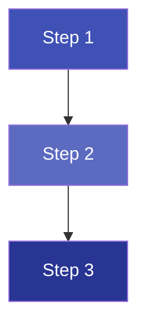

# X.Y Topic Title

---

## Theory

!!! note "Definition"
    Write the formal definition of the key concept here.

### Sub-heading 1

Write the main theory here. You can use:

- **Bold** for key terms
- *Italics* for emphasis
- Tables for structured information
- Mermaid diagrams for flowcharts
- Math equations for formulas

### Flowchart / Diagram (optional)



### Mathematical Formula (optional)

Inline math: $y = mx + c$

Block math:

$$
\hat{y} = \beta_0 + \beta_1 x_1 + \beta_2 x_2
$$

### Summary Table

| Term | Definition | Example |
|------|-----------|---------|
| Term 1 | Definition 1 | Example 1 |
| Term 2 | Definition 2 | Example 2 |

### Admonitions

!!! tip "Tip"
    Write a helpful tip here.

!!! warning "Warning"
    Write an important warning here.

!!! info "Note"
    Write additional information here.

---

## Examples

### Example 1 — [Short title]

Describe the example scenario here.

| Input | Expected Output |
|-------|----------------|
| ... | ... |

---

## Python Program

### Program

```python linenums="1" title="topic_x_y.py"
# Program : [Program Description]
# Topic   : X.Y [Topic Title]
# Author  : BT255CO Lecture Notes

# -------------------------------------------------------
# Step 1: Import required libraries
# -------------------------------------------------------
import numpy as np
import pandas as pd

# -------------------------------------------------------
# Step 2: [Description of this section]
# -------------------------------------------------------

# Your code here

# -------------------------------------------------------
# Step 3: Output
# -------------------------------------------------------
print("Result:", result)
```

### Output

```
[Paste exact program output here]
```

### Line-by-Line Explanation

| Line(s) | Code | Explanation |
|---------|------|-------------|
| 1–3 | `# Program ...` | Comment block documenting the program's purpose |
| 5 | `import numpy as np` | Imports the NumPy library for numerical operations |
| ... | `...` | ... |

---

## Summary

!!! success "Key Takeaways"
    - Bullet 1: Most important takeaway
    - Bullet 2: Second key point
    - Bullet 3: Third key point
    - Bullet 4: Common mistake to avoid

---

## Exercises

!!! question "Practice Problems"

    1. Exercise 1 description.
    2. Exercise 2 description.
    3. **Challenge:** Harder exercise.

---

## Review Questions

1. Question 1?
2. Question 2?
3. Question 3?
4. Question 4?
5. Question 5?

---

## References

1. Author, A. (Year). *Book Title*. Publisher.
2. Author, B. (Year). "Article Title". *Journal Name*, Vol(Issue).
3. [Link description](https://example.com)

---

*Previous:* ← X.(Y-1) Previous Topic &nbsp;|&nbsp; *Next:* X.(Y+1) Next Topic →
