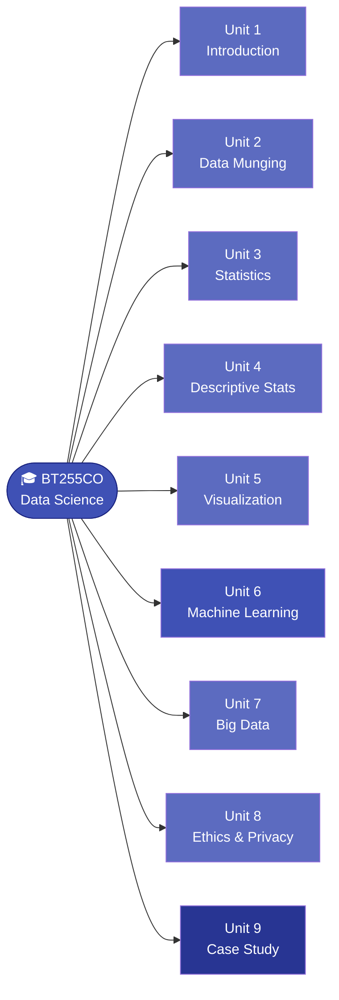

<div class="hero-section" markdown>

# :books: BT255CO Introduction to Data Science

** B.Tech. in Artificial Intelligence **

<div class="course-meta" markdown>
<span class="meta-badge">:mortar_board: Prof. Raj Kumar Thakur</span>
<span class="meta-badge">:classical_building: Purbanchal University</span>
<span class="meta-badge">:calendar: Semester III · 2024–25</span>
<span class="meta-badge">:clock1: 3 Credit Hours</span>
</div>

</div>

---

## Welcome :wave:

These are the **official lecture notes** for *BT255CO — Introduction to Data Science*.  
All theory, examples, programs, and exercises are organized unit-wise and accessible from the left navigation panel.

!!! tip "How to use this book"
    - Use the **left sidebar** to navigate between units and topics.
    - Use the **search box** (top-right) to find any concept instantly.
    - Use the **:material-brightness-4: / :material-brightness-7: toggle** in the header to switch between dark and light mode.
    - Every code block has a **copy button** — click it to copy code directly.

---

## Course Description

Data Science is an interdisciplinary field that combines **statistics**, **computer science**, and **domain knowledge** to extract meaningful insights from data. This course introduces students to the entire data science pipeline — from data collection and cleaning to analysis and machine learning.

By the end of this course, students will be able to work with real-world datasets, apply statistical and machine learning techniques, and communicate findings effectively.

---

## Learning Outcomes

After completing this course, you will be able to:

- [x] Understand the fundamentals of Data Science and its applications
- [x] Differentiate between types of data and apply appropriate preprocessing techniques
- [x] Use Python libraries (NumPy, Pandas, Matplotlib) for data manipulation and visualization
- [x] Perform Exploratory Data Analysis (EDA) on real-world datasets
- [x] Apply basic supervised and unsupervised machine learning algorithms
- [x] Evaluate model performance using standard metrics
- [x] Communicate data-driven insights through visualizations and reports

---

## Course Overview



---

## Table of Contents

<div class="cards-grid" markdown>

<div class="info-card" markdown>

### :material-numeric-1-box: Unit 1 — Introduction to Data Science *(4H)*

| # | Topic |
|---|-------|
| 1.1 | [Definition and Scope](Unit1/1_1.md) |
| 1.2 | [Applications of Data Science](Unit1/1_2.md) |
| 1.3 | [Limitations of Data Science](Unit1/1_3.md) |
| 1.4 | [Types of Data](Unit1/1_4.md) |
| 1.5 | [Data Science Life-Cycle](Unit1/1_5.md) |
| 1.6 | [Collection, Cleaning & Preprocessing](Unit1/1_6.md) |
| 1.7 | [Storage and Retrieval](Unit1/1_7.md) |
| 1.8 | [Methodologies — CRISP-DM & OSEMN](Unit1/1_8.md) |

</div>

<div class="info-card" markdown>

### :material-numeric-2-box: Unit 2 — Data Munging *(5H)*

| # | Topic |
|---|-------|
| 2.1 | [Data Quality](Unit2/2_1.md) |
| 2.2 | [Common Issues with Real-World Data](Unit2/2_2.md) |
| 2.3 | [Cleaning and Standardizing Data](Unit2/2_3.md) |
| 2.4 | [Data Enrichment](Unit2/2_4.md) |
| 2.5 | [Data Validation](Unit2/2_5.md) |

</div>

<div class="info-card" markdown>

### :material-numeric-3-box: Unit 3 — Statistical Analysis in Python *(3H)*

| # | Topic |
|---|-------|
| 3.1 | [Hypothesis Testing](Unit3/3_1.md) |
| 3.2 | [Correlation and Regression Analysis](Unit3/3_2.md) |

</div>

<div class="info-card" markdown>

### :material-numeric-4-box: Unit 4 — Descriptive Statistics *(4H)*

| # | Topic |
|---|-------|
| 4.1 | [Measures of Central Tendency & Dispersion](Unit4/4_1.md) |
| 4.2 | [Visualization with Matplotlib & Seaborn](Unit4/4_2.md) |

</div>

<div class="info-card" markdown>

### :material-numeric-5-box: Unit 5 — Data Visualization *(4H)*

| # | Topic |
|---|-------|
| 5.1 | [Exploring Data Through Graphs and Charts](Unit5/5_1.md) |
| 5.2 | [Interactive Visualization Tools](Unit5/5_2.md) |

</div>

<div class="info-card" markdown>

### :material-numeric-6-box: Unit 6 — Machine Learning *(10H)*

| # | Topic |
|---|-------|
| 6.1 | [Types of Machine Learning](Unit6/6_1.md) |
| 6.2 | [Supervised vs. Unsupervised Learning](Unit6/6_2.md) |
| 6.2.1 | [Linear Regression](Unit6/6_2_1.md) |
| 6.2.2 | [Decision Trees & Random Forests](Unit6/6_2_2.md) |
| 6.2.3 | [Support Vector Machines](Unit6/6_2_3.md) |
| 6.3.1 | [Clustering — K-Means & Hierarchical](Unit6/6_3_1.md) |
| 6.3.2 | [Dimensionality Reduction — PCA](Unit6/6_3_2.md) |

</div>

<div class="info-card" markdown>

### :material-numeric-7-box: Unit 7 — Introduction to Big Data *(5H)*

| # | Topic |
|---|-------|
| 7.1 | [Introduction to Big Data](Unit7/7_1.md) |
| 7.2 | [History of Big Data](Unit7/7_2.md) |
| 7.3 | [The Six Vs of Big Data](Unit7/7_3.md) |
| 7.4 | [Characteristics of Big Data](Unit7/7_4.md) |
| 7.5 | [Challenges and Future](Unit7/7_5.md) |
| 7.6 | [Practices and Use Cases](Unit7/7_6.md) |
| 7.7 | [Data Warehouse and Data Lakes](Unit7/7_7.md) |
| 7.8 | [Big Data Analytics](Unit7/7_8.md) |

</div>

<div class="info-card" markdown>

### :material-numeric-8-box: Unit 8 — Data Science Ethics & Privacy *(6H)*

| # | Topic |
|---|-------|
| 8.1 | [Data Science Ethics](Unit8/8_1.md) |
| 8.2 | [Principles of Data Ethics](Unit8/8_2.md) |
| 8.3 | [Privacy Concerns and Regulations](Unit8/8_3.md) |
| 8.4 | [Benefits of Data Ethics](Unit8/8_4.md) |
| 8.5 | [Laws Related to Data Protection](Unit8/8_5.md) |
| 8.6 | [Considerations for Ethics in Data Science](Unit8/8_6.md) |

</div>

<div class="info-card" markdown>

### :material-numeric-9-box: Unit 9 — Case Study *(2H)*

| # | Topic |
|---|-------|
| 9.1 | [Real-Life Data Science — Amazon](Unit9/9_1.md) |

</div>

</div>

---

## Tools & Technologies

The following tools are used throughout this course:

=== "Language"
    ```
    Python 3.x
    ```

=== "Libraries"
    ```
    numpy        — numerical computing
    pandas       — data manipulation
    matplotlib   — plotting
    seaborn      — statistical visualization
    scikit-learn — machine learning
    ```

=== "Environment"
    ```
    Jupyter Notebook / VS Code
    Google Colab (browser-based, no installation needed)
    ```

---

## Recommended Textbooks

| # | Book | Authors |
|---|------|---------|
| 1 | *Introducing Data Science* | Cielen, Meysman & Ali |
| 2 | *Python for Data Analysis* | Wes McKinney |
| 3 | *Hands-On Machine Learning with Scikit-Learn, Keras & TensorFlow* | Aurélien Géron |
| 4 | *Data Science from Scratch* | Joel Grus |

---

## A Quick Taste — Python + Math

Here's what you'll be doing in this course:

```python
import numpy as np
import pandas as pd

# Create a simple dataset
data = pd.DataFrame({
    'hours_studied': [1, 2, 3, 4, 5, 6, 7, 8],
    'score':         [40, 50, 55, 65, 70, 80, 85, 92]
})

# Compute correlation
correlation = data.corr()
print(correlation)
```

The **Pearson correlation coefficient** between two variables $X$ and $Y$ is:

$$
r = \frac{\sum_{i=1}^{n}(x_i - \bar{x})(y_i - \bar{y})}
         {\sqrt{\sum_{i=1}^{n}(x_i - \bar{x})^2 \cdot \sum_{i=1}^{n}(y_i - \bar{y})^2}}
$$

---

## Contact

| | |
|---|---|
| **Instructor** | Prof. Raj Kumar Thakur |
| **Email** | rajkshiva1@gmail.com |
| **Office** | Purbanchal University School of Science and Technology |
| **Address** | Biratnagar, Nepal |

---

*Last updated: 2024–25 · Semester III*
